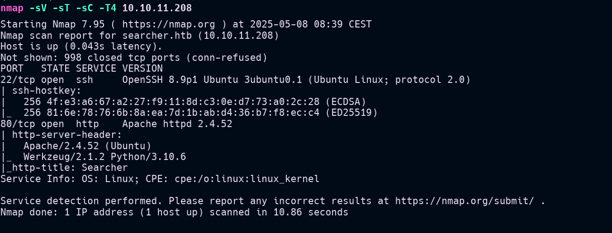
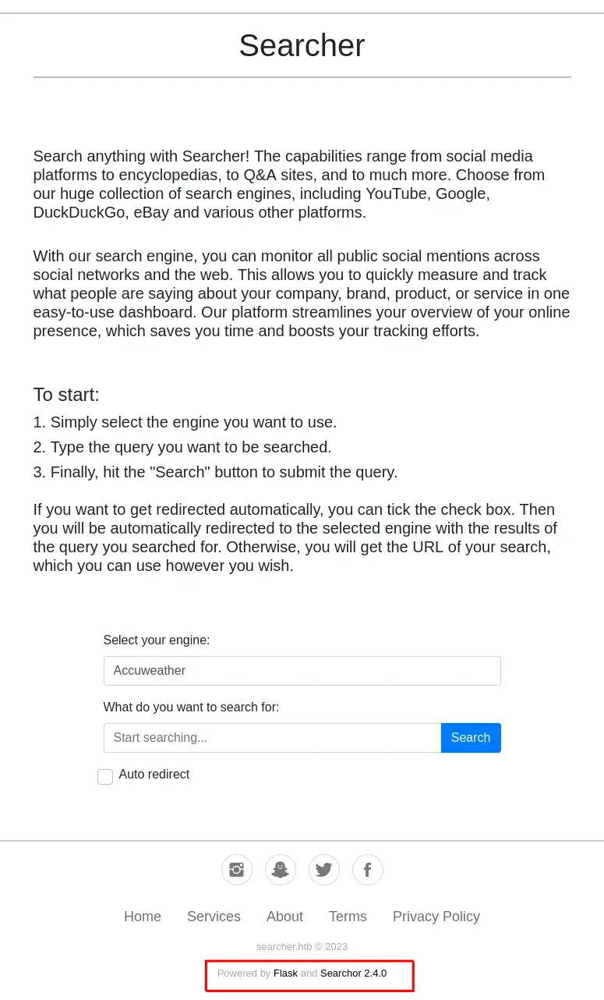

+++
title = "HackTheBox-Busqueda machine walkthrough"
date = 2025-05-11
draft = false
tags = ["HackTheBox", "HTB", "Walkthrough"]
categories = []
description = "A walkthrough of the HackTheBox Busqueda machine, perfect for beginners"
summary = "A step-by-step guide to solve the Busqueda machine from HackTheBox"
+++
# HackTheBox-Busqueda machine walkthrough

This is a walkthrough of the HackTheBox machine Busqueda. The machine is a retired machine on HackTheBox, and it is a great machine for beginners to practice their skills.

## Enumeration

 first, we need to enumerate the machine. We can use Nmap to scan the machine for open ports and services. The command we will use is:
 ```bash
 nmap -sV -sT -sC -T4 10.10.11.208
 ```
 
The scan results show that the machine has two open ports: 22 and 80. Port 22 is running OpenSSH 7.9p1, and port 80 is running Apache httpd 2.4.52.

 ## Web Enumeration
 To get access to the web server, we need to add the IP address of the machine to our hosts file. We can do this by running the following command:
 ```bash
 echo "10.10.11.208  searcher.htb" | sudo tee -a /etc/hosts
 ```
 
Now we can access the web server by going to http://searcher.htb in our web browser.


after searching for the Searchor on the internett i found the [Github](https://github.com/ArjunSharda/Searchor) page for the Searchor project.
