+++
title = "HackTheBox-Planning machine walkthrough"
date = 2025-05-21
draft = false
tags = ["hackthebox", "grafana", "cve-2024-9264", "privilege escalation"]
categories = ["CTF", "Penetration Testing", "Vulnerability Exploitation"]
description = "A detailed walkthrough of the Planning machine from HackTheBox, exploiting a critical Grafana vulnerability (CVE-2024-9264) and leveraging crontab-ui for privilege escalation"
summary = "In this walkthrough, I demonstrate how to compromise the Planning machine on HackTheBox by discovering a vulnerable Grafana instance, exploiting CVE-2024-9264 for initial access, and escalating privileges through a crontab-ui service."
+++

# HackTheBox-Planning machine walkthrough

This walkthrough details the process of compromising the Planning machine from HackTheBox. It demonstrates reconnaissance techniques, vulnerability identification, exploitation of a critical Grafana vulnerability, and privilege escalation methods.

## Initial Enumeration 

I began by performing a comprehensive port scan using Nmap to identify open ports and running services:

```bash
nmap -sV -sT -sC -T4 10.10.11.68
```

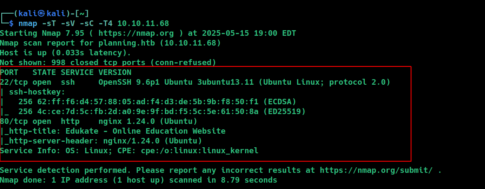

The scan revealed several open ports, including web services that would be our initial attack surface. To continue exploring, I added the target domain to my hosts file:

```bash
echo "10.10.11.68  planning.htb" | sudo tee -a /etc/hosts
```

After adding the domain, I accessed the website at `http://planning.htb`.


After thoroughly exploring the website, I couldn't find any immediate vulnerabilities or useful information through manual inspection. At this point, I decided to perform a subdomain enumeration to discover any hidden subdomains.

## Subdomain Enumeration

For this purpose, I used the `ffuf` web fuzzer tool along with SecLists wordlists, which are excellent for discovery tasks:

```bash
ffuf -w /usr/share/wordlists/seclists/Discovery/DNS/bitquark-subdomains-top100000.txt -u 'http://10.10.11.68' -H "Host:FUZZ.planning.htb" -fs 178
```

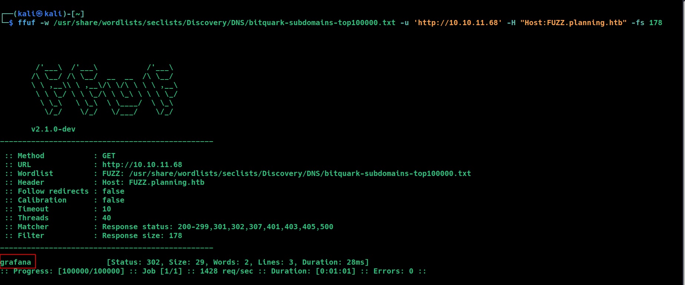

I found a subdomain called `grafana`.

### What is Grafana?

Grafana is an open-source analytics and monitoring platform that connects to various data sources and provides visualization capabilities through dashboards. It's often used for operational monitoring and IoT analytics, making it an interesting target in our attack chain.

To access this subdomain, I added it to my hosts file:

```bash
echo "10.10.11.68  grafana.planning.htb" | sudo tee -a /etc/hosts
```

Then I accessed the Grafana instance at `http://grafana.planning.htb`:


For login credentials, I used the information provided in the machine description on HackTheBox: `admin / 0D5oT70Fq13EvB5r`.

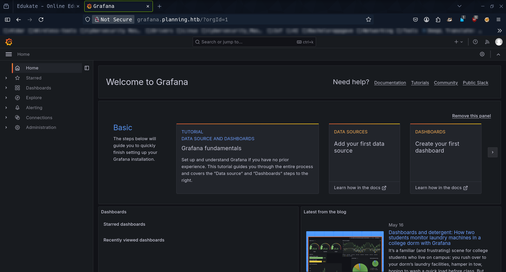

## Vulnerability Discovery and Exploitation

After gaining access to the Grafana dashboard, I checked the version information:

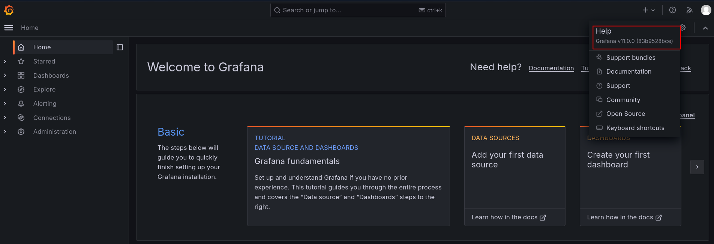

The system was running Grafana version 11.0.0. I researched this version and discovered it's vulnerable to a critical security issue: **CVE-2024-9264**.

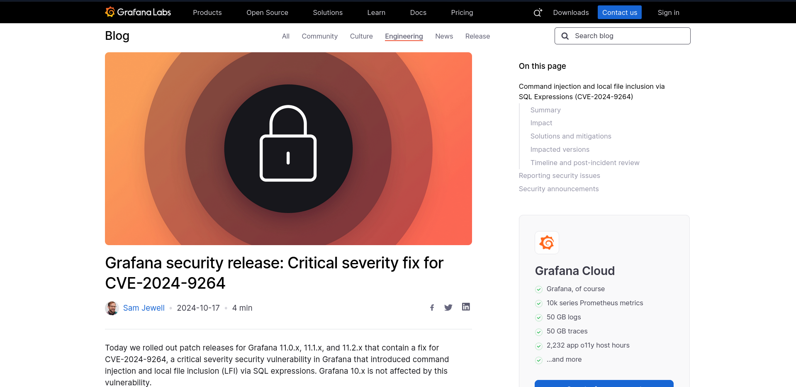

### Understanding CVE-2024-9264

CVE-2024-9264 is a critical vulnerability in Grafana that affects versions up to 11.0.0. This vulnerability involves an unauthenticated directory traversal and remote code execution (RCE) flaw in the AuthProxy authentication method, which allows attackers to:

1. Execute arbitrary system commands on the host server
2. Access local files on the system (Local File Inclusion)
3. Potentially gain a reverse shell to the target system

### Exploitation Process

I found a GitHub repository with a proof-of-concept exploit for this vulnerability:

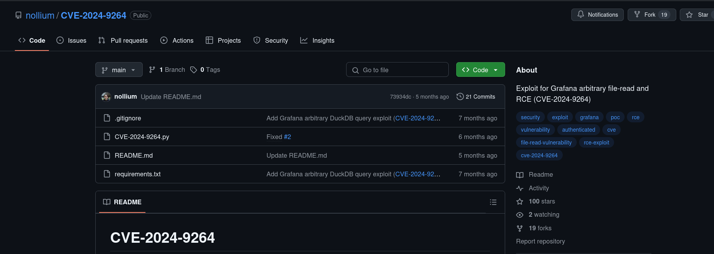

I cloned the repository to my local machine:

```bash
git clone https://github.com/nollium/CVE-2024-9264.git
```

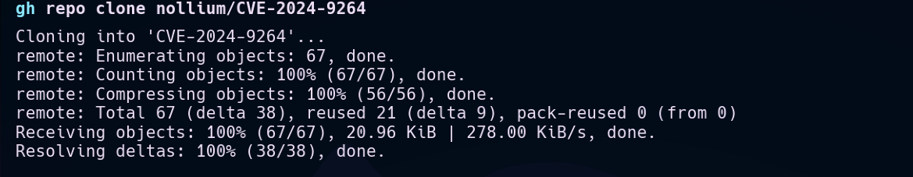

Then I prepared the exploit by installing all the required dependencies:

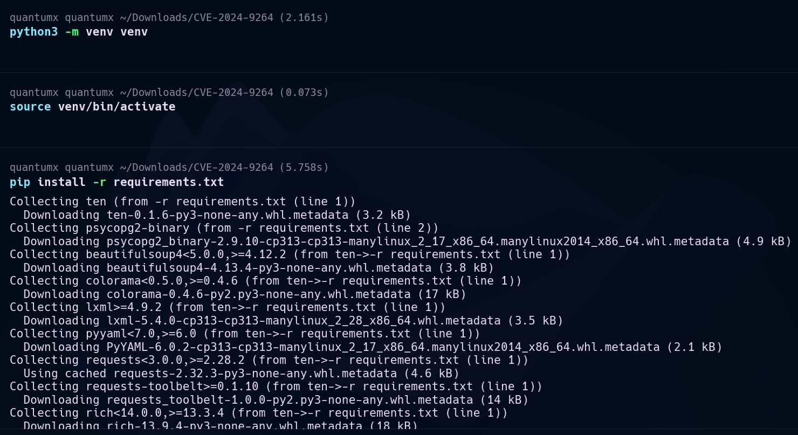

For the exploit, I used the previously obtained Grafana dashboard credentials and prepared a command that would create a reverse shell to my local machine (`10.10.16.6`) on port `4444`. 

Simultaneously, I set up a netcat listener on my local machine to capture the incoming connection:

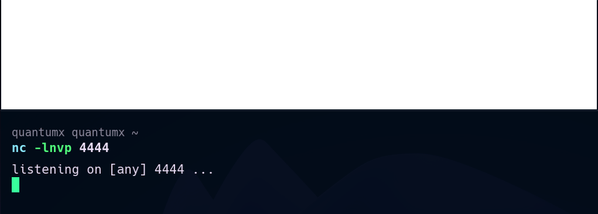

Then I launched the exploit against the target:

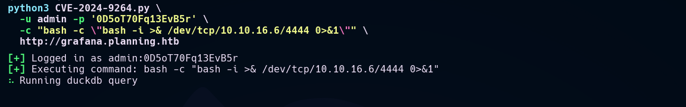

## Initial Access

Successfully! I received a connection back from the target machine and began exploring the system to locate the user flag.

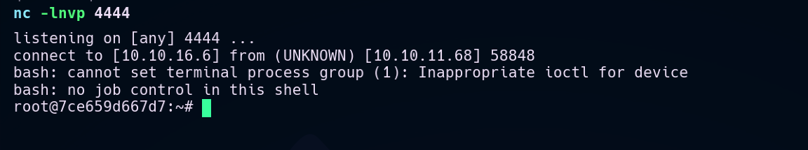

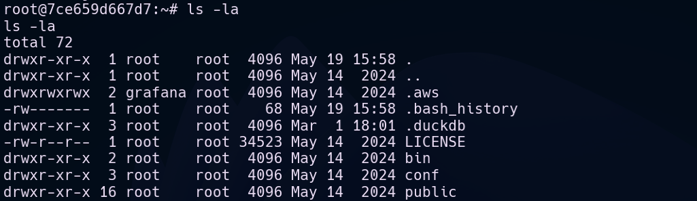

Since Grafana was running on the machine, I examined the `/var` directory and found some interesting information in the Grafana folder. While checking environment variables, I discovered credentials:

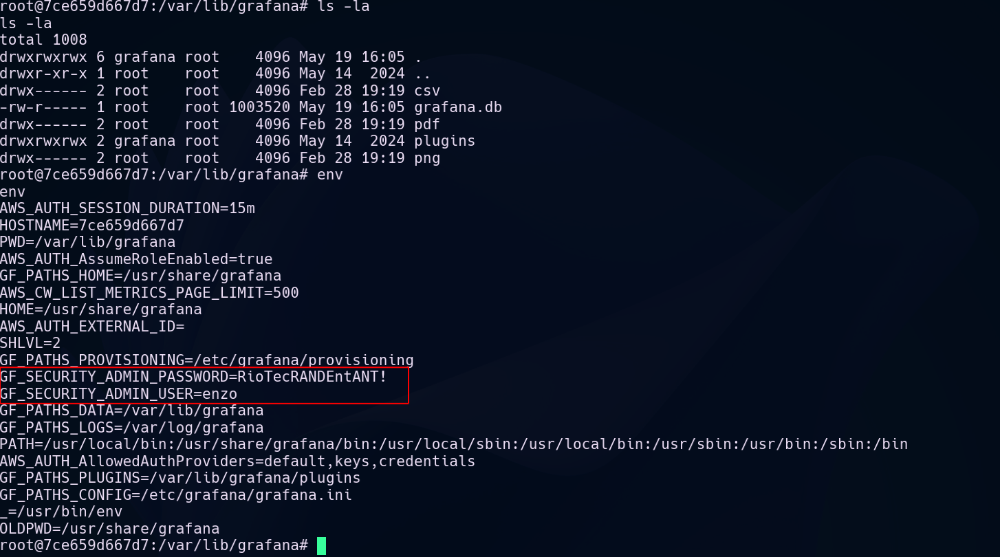

I found credentials for a user named `enzo` with the password `RioTecRANDEntANT!`. Using these credentials, I established an SSH connection to the target:

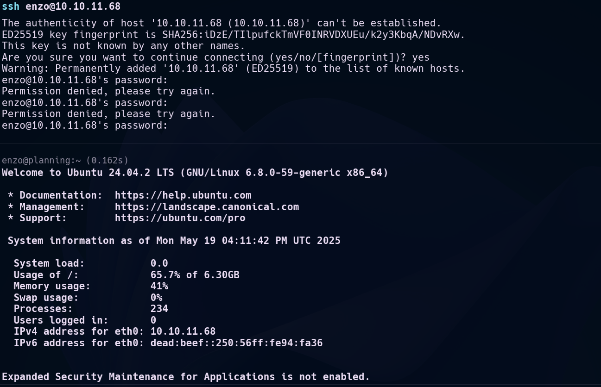

With this access, I was able to retrieve the user flag:

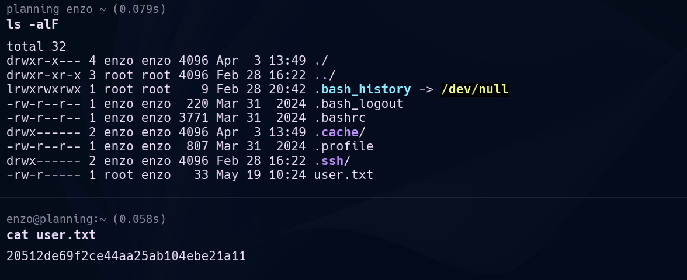

## Privilege Escalation 

After obtaining user access, I began enumerating the system for privilege escalation opportunities. I checked for active network connections:

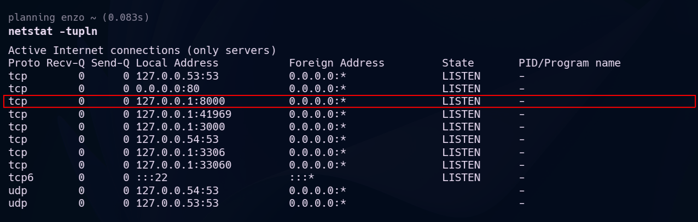

I found several active listening connections on internal ports, which suggested potential services running locally on the machine.

Continuing my search as the `enzo` user, I looked for hidden credentials or interesting services:

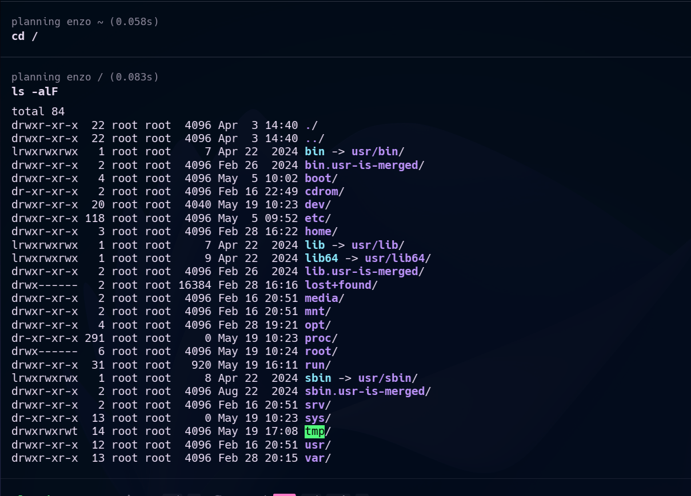

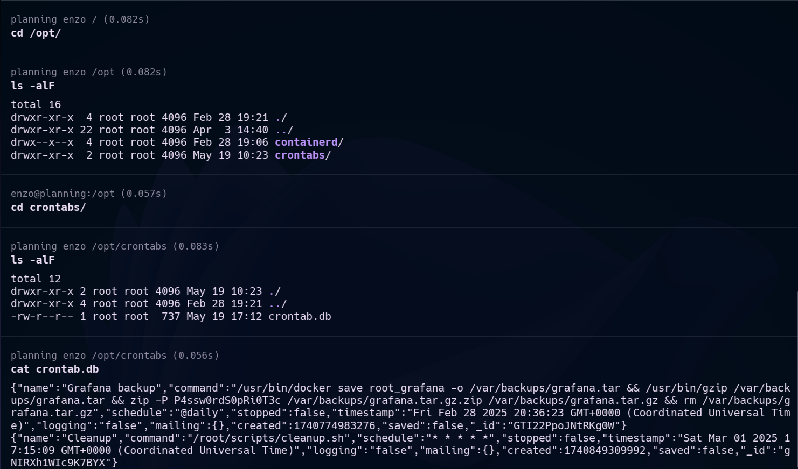

I discovered a password, but wasn't immediately sure what it was for. To further investigate the active connections on the machine, I set up SSH local port forwarding to access services running on internal ports:

```bash
ssh -L 8000:127.0.0.1:8000 enzo@planning.htb
```

This allowed me to access a service running on port 8000, which turned out to be a crontab-ui dashboard:

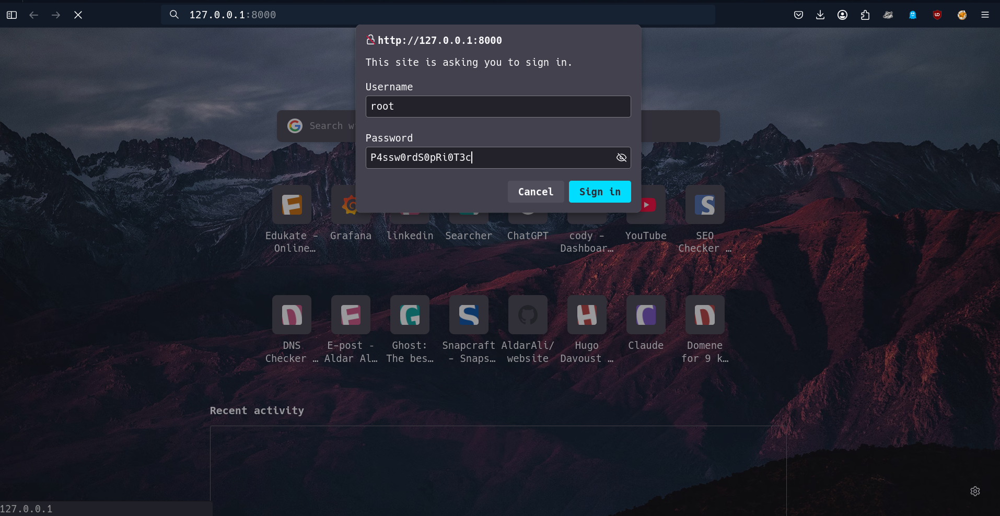


### Exploiting Crontab-UI

Crontab-UI is a web interface for managing cron jobs, and it was running with root privileges. This presented an excellent opportunity for privilege escalation, as any job created would run as root.

I created a cronjob named `rootbash` with the following command:

```bash
cp /bin/bash /tmp/rootbash && chmod u+s /tmp/rootbash
```

This command does two critical things:
1. Copies the bash shell to `/tmp/rootbash`
2. Sets the SUID bit on the copied bash executable

The SUID (Set User ID) bit is a special permission that allows a user to execute a file with the permissions of the file's owner. Since cron jobs run as root, the copied bash will maintain root ownership, and the SUID bit will allow me to execute it with root privileges.

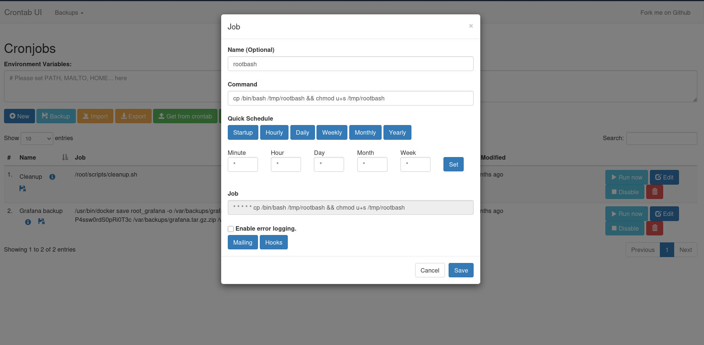

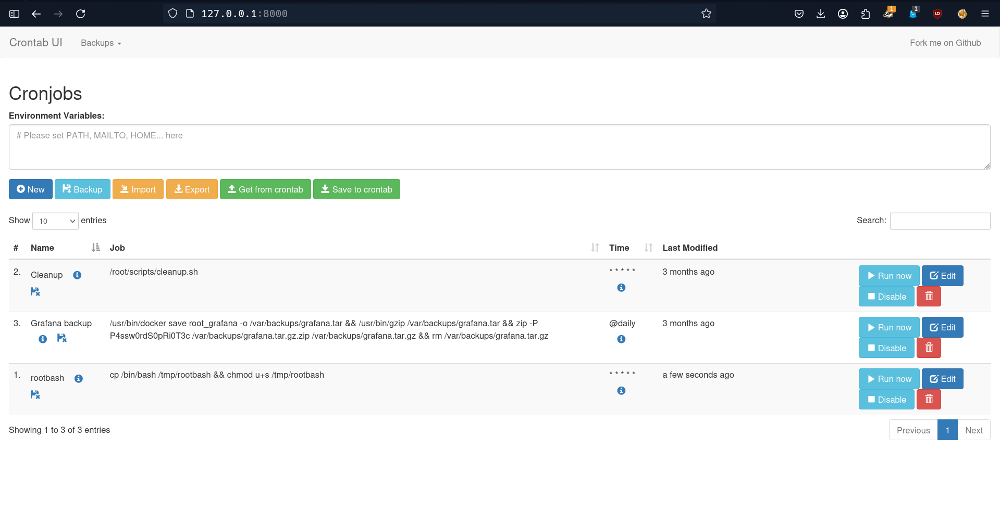

After the cronjob executed, I confirmed the existence of the new SUID bash shell in the `/tmp` folder:

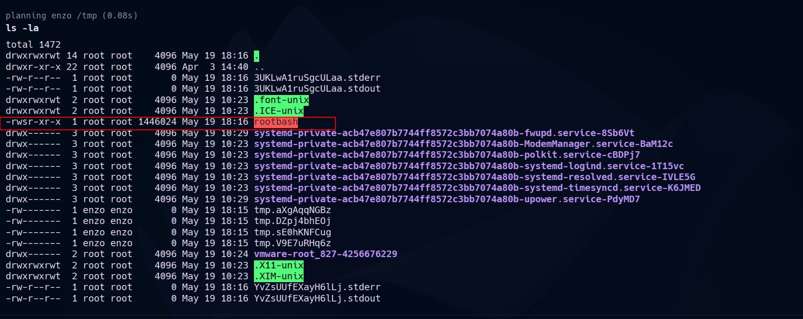

I then executed this binary with the `-p` flag to maintain the effective privileges, giving me a root shell:

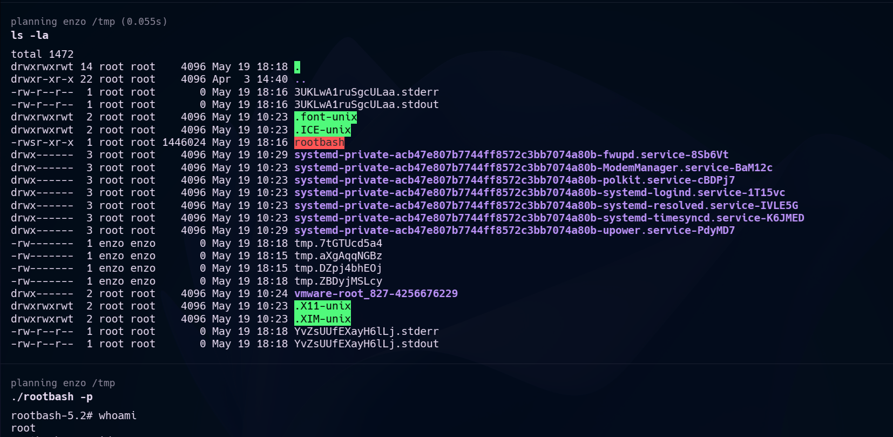

With root access established, I retrieved the root flag:

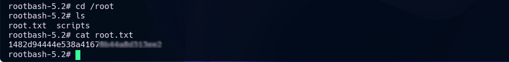

## Conclusion

The Planning machine demonstrated a practical attack chain involving:
1. Subdomain discovery to find a vulnerable Grafana instance
2. Exploitation of CVE-2024-9264 in Grafana 11.0.0 to gain initial access
3. Credential discovery for lateral movement to a regular user account
4. Privilege escalation through a crontab-ui service with root permissions

This walkthrough highlights the importance of proper security configuration, regular patching, and the principle of least privilege in system administration.

## Resources

- [Github-CVE-2024-9264](https://github.com/nollium/CVE-2024-9264) - Exploit code for the Grafana vulnerability
- [Grafana-security-release](https://grafana.com/blog/2024/10/17/grafana-security-release-critical-severity-fix-for-cve-2024-9264/) - Official security advisory for the vulnerability
- [SSH local port forwarding documentation](https://www.ssh.com/academy/ssh/tunneling-example) - Guide on SSH port forwarding techniques
- [SecLists](https://github.com/danielmiessler/SecLists) - Collection of wordlists for security assessments
- [ffuf web fuzzer](https://github.com/ffuf/ffuf) - Fast web fuzzer for subdomain and content discovery
