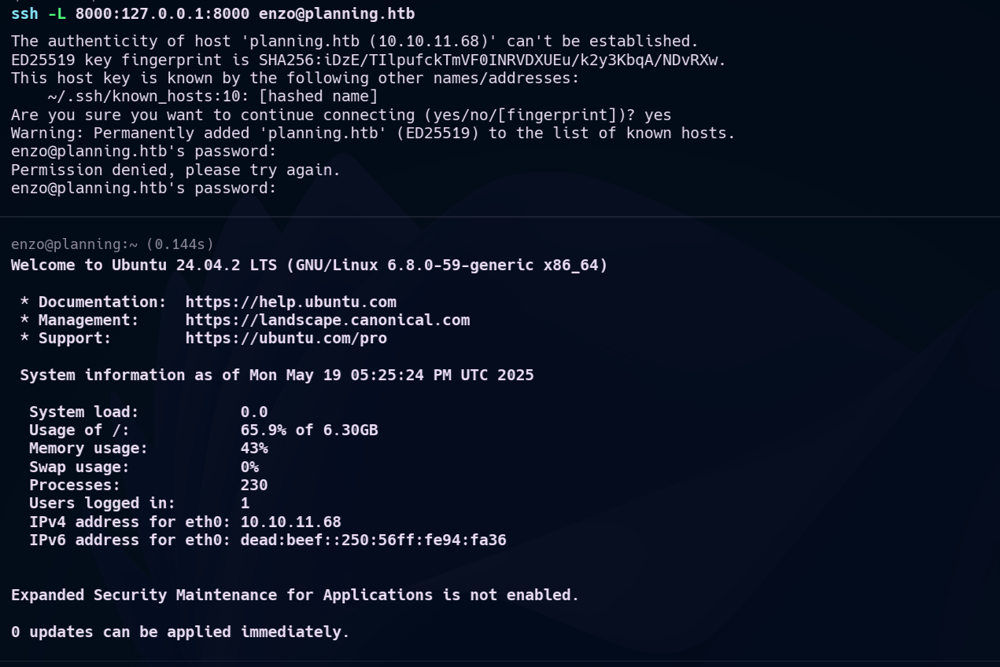

+++
title = "HackTheBox-Planning maskin gjennomgang"
date = 2025-05-21
draft = false
tags = ["hackthebox", "grafana", "cve-2024-9264", "privilegie eskalering"]
categories = ["CTF", "Penetrasjonstesting", "Sårbarhetsutnyttelse"]
description = "En detaljert gjennomgang av Planning-maskinen fra HackTheBox, som utnytter en kritisk Grafana-sårbarhet (CVE-2024-9264) og utnytter crontab-ui for privilegie-eskalering"
summary = "I denne gjennomgangen demonstrerer jeg hvordan man kompromitterer Planning-maskinen på HackTheBox ved å oppdage en sårbar Grafana-instanse, utnytte CVE-2024-9264 for initial tilgang, og eskalere privilegier gjennom en crontab-ui tjeneste."
+++

# HackTheBox-Planning maskin gjennomgang

Denne gjennomgangen detaljerer prosessen med å kompromittere Planning-maskinen fra HackTheBox. Den demonstrerer rekognoseringsteknikker, sårbarhet identifikasjon, utnyttelse av en kritisk Grafana-sårbarhet, og privilegie-eskalering metoder.

## Innledende Enumerering

Jeg startet med å utføre en omfattende port-skanning ved hjelp av Nmap for å identifisere åpne porter og kjørende tjenester:

```bash
nmap -sV -sT -sC -T4 10.10.11.68
```


Skanningen avslørte flere åpne porter, inkludert webtjenester som ville være vår innledende angrepsflett. For å fortsette utforskningen, la jeg til måldomenet i hosts-filen min:

```bash
echo "10.10.11.68  planning.htb" | sudo tee -a /etc/hosts
```

## Subdomain Enumerering

Etter initial rekognisering kjørte jeg subdomain-enumerering for å oppdage ytterligere angrepsflett:


Jeg oppdaget et interessant subdomain som kjørte Grafana, et overvåknings- og observabilitetsverktøy.


## Grafana Versjon Identifikasjon

Ved å undersøke Grafana-instansen identifiserte jeg versjonen som kjørte:


Denne versjonen viste seg å være sårbar for CVE-2024-9264, en kritisk sårbarhet.

## Sårbarhet Forskning

Jeg undersøkte sårbarheten ytterligere og fant detaljert informasjon om CVE-2024-9264:


## Exploitutvikling

Jeg lastet ned et exploit-repositorium fra GitHub:


Og forberedte exploit for bruk:


## Utnyttelse

Med exploitet klar, gjennomførte jeg angrep mot den sårbare Grafana-instansen:


Dette ga meg initial fotfeste på systemet.

## SSH Port Forwarding

For bedre tilgang satte jeg opp SSH port-forwarding:




## Initial Tilgang og Enumerering

Etter å ha fått initial tilgang, startet jeg enumerering av systemet:


## Crontab-UI Oppdagelse

Under enumerering oppdaget jeg en crontab-ui tjeneste som kjørte:


## Privilegie Eskalering

Jeg brukte crontab-ui til å lage nye scheduled jobs for privilegie-eskalering:


## Root Tilgang

Gjennom clever utnyttelse av crontab-systemet oppnådde jeg root-tilgang:


## Konklusjon

Planning-maskinen demonstrerer flere viktige cybersikkerhetskonsepter:

1. **Subdomain Enumerering**: Viktigheten av grundig rekognisering
2. **CVE Utnyttelse**: Hvordan kjente sårbarheter kan utnyttes
3. **Scheduled Task Utnyttelse**: Bruk av system-tjenester for eskalering
4. **Port Forwarding**: Teknikker for å opprettholde tilgang

### Viktige Lærdommer

- Alltid enumerer subdomains grundig
- Hold alle system-komponenter oppdaterte
- Overvåk og sikre administrative grensesnitt
- Implementer principe of least privilege for system-tjenester

*Denne gjennomgangen er for utdanningsformål. Sørg alltid for at du har tillatelse før du utfører penetrasjonstesting.*
