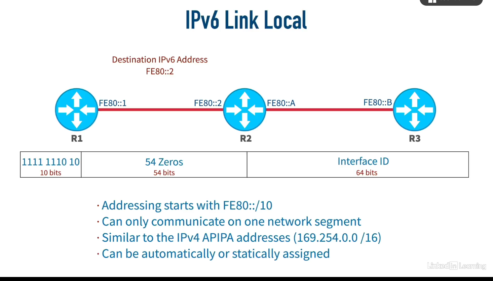

+++
title = ""
date = 2025-06-30
draft = true
tags = []
categories = []
description = ""
summary = ""
+++
# IPv6
IPv6 is the next generation internet protocol, designet to replace the IPv4.

128-bit

32-hexadecimal numbers

8 "quartets" of 4 hexadecimal digits.

## IPv6 global unicast

- **Global Unicast Addresses**: These are publicly routable IPv6 addresses, starting with 2000::/3, which means the first three bits are 001.
- **Address Structure**: The address is divided into a global routing prefix (assigned by IANA), a subnet ID, and a host/interface identifier.
- **Routing**: These addresses are used to uniquely route traffic across the global internet, making them essential for network communication.

In an IPv6 Global Unicast address, the first three bits being 001 is crucial for identifying the address type.  

- **Binary Representation**: IPv6 addresses are 128 bits long. The first three bits being 001 means that the address falls within a specific range.
- **Hexadecimal Translation**: Each hexadecimal digit represents 4 bits. Therefore, the first three bits (001) can translate to multiple hexadecimal values. Specifically:  

- 0010 in binary is 2 in hexadecimal.
- 0011 in binary is 3 in hexadecimal.
  
This means that an IPv6 Global Unicast address can start with either a 2 or a 3 in its hexadecimal form. However, in literature, it's often represented as starting with 2000::/3, indicating that the first three bits are 001.  

- **Global Routing Prefix**: The next 45 bits after the first three bits represent the global routing prefix, which is unique to an organization and assigned by the Internet Assigned Numbers Authority (IANA).

## IPv6 Multicast

- **IPv6 Multicast Address Format**: An IPv6 multicast address starts with "FF", indicating the first eight bits are all ones. The next four bits are flags, followed by four scope bits that define how far the multicast traffic can travel.

| 1111 1111  | Flags  | Scope  | Group                          ID |
| ------------- | ------ | ------ | --------------------------------- |
| 8 bits        | 4 bits | 4 bits | 112                  bits         |
![[ipv6-multicast.png]]
- **Multicast Groups**: Devices can join multicast groups to receive specific traffic. For example, if a video server sends traffic to a multicast group, only the devices in that group will receive it.
- **Scope Bits**: These bits determine the reach of the multicast traffic, such as link-local (FF02::1 for all nodes, FF02::2 for all routers) or other defined scopes.

![[ipv6-multicast1.png]]

![[ipv6-multicast-scope.png]]

## IPv6-link-local

- **Format**: An IPv6 link-local address starts with **`FE80::/10`**, where the first 10 bits are `1111 1110 10`, followed by 54 zeros, and the last 64 bits come from the interface ID.
- **Usage**: These addresses are only usable on a local network segment and cannot be routed.
- **Comparison**: IPv6 link-local addresses are similar to IPv4 APIPA addresses, which are also self-assigned and only usable on the local network segment.
- **Router Communication**: IPv6 link-local addresses are often used for inter-router communication within the same network segment.

## IPv6-unique-local

- **IPv6 Unique Local Address**: These addresses can be routed within your company but are not routable on the public internet.
- **Address Format**: Starts with **`FC00::/7`** or **`FD00::/7`**,  since we didn't specified the 8 bit, it can be 0 or 1 if it's 0 =C or if it's 1=D ,  with the next bit (L bit) indicating local assignment. Commonly begins with `FD`.
- **Comparison to IPv4**: Similar to IPv4's RFC 1918 addresses (e.g., 10.0.0.0/8), which are used within a company but not routable on the public internet.
![[ipv6-unique-local.png]]

## IPv6-loopback

![[ipv6-loopback.png]]

## IPv6 unspecified

- **IPv6 Unspecified Address**: An IPv6 unspecified address is written as `::` and consists of all zeros (128 bits). It is used when a device does not have an assigned IPv6 address.
- **Usage Scenarios**: This address can be used as a source address when sending a neighbor solicitation message to dynamically generate its own IPv6 address.
- **Duplicate Address Detection (DAD)**: The unspecified address is also used in the process of Duplicate Address Detection to ensure no other device on the network has the same self-generated IPv6 address.

![[ipv6-unspecified.png]]

## IPv6 solicited-node multicast

IPv6 solicited-node multicast addresses are special-purpose multicast addresses used primarily for efficient address resolution in IPv6 networks. Here's how they work:
### What They Are

A solicited-node multicast address is a multicast address that corresponds to a specific unicast or anycast IPv6 address. Every IPv6 unicast/anycast address has an associated solicited-node multicast address.

### Address Format

The solicited-node multicast address is formed by:

- Starting with the prefix: `FF02:0:0:0:0:1:FF00::/104`
- Taking the last 24 bits (6 hex digits) of the unicast/anycast address
- Appending those 24 bits to create: `FF02::1:FFXX:XXXX`

For example:

- If your unicast address is `2001:DB8::1234:5678`
- The last 24 bits are `34:5678`
- The solicited-node multicast address is `FF02::1:FF34:5678`

### Purpose

The main purposes are:

1. **Efficient Neighbor Discovery**: Instead of broadcasting ARP requests to all nodes (as in IPv4), IPv6 uses solicited-node multicast to reach only nodes that might have the target address
   
2. **Duplicate Address Detection (DAD)**: When configuring an address, a node sends Neighbor Solicitation messages to the solicited-node multicast address to check if anyone else is using it

3. **Address Resolution**: To find the link-layer (MAC) address of a neighbor, nodes send Neighbor Solicitation messages to the solicited-node multicast address

### How It Works

When a node configures an IPv6 address, it:

1. Calculates the corresponding solicited-node multicast address
2. Joins that multicast group on the local link
3. Listens for Neighbor Solicitation messages sent to that address

This means that instead of every node processing every address resolution request (as with broadcast ARP in IPv4), only nodes with matching address suffixes process the request, significantly reducing unnecessary network processing.
![[ipv6-solicited-node multicast.png]]

## EUI-64

- **EUI-64 Process**: The video explains how to generate a 64-bit interface ID from a 48-bit MAC address by inserting "FFFE" in the middle of the MAC address and flipping the seventh bit.
- **64-bit Interface ID**: This process creates a 64-bit host ID, which is used as the host portion of an IPv6 address.
- **Locally Administered Addresses**: Flipping the seventh bit indicates that the address is locally administered, not globally unique.

![[ipv6-eui64.png]]

## Dynamic IPv6 address assignment

![[ipv6-dhcp.png]]

![[ipv6-dhcp1.png]]

![[ipv6-dhcp2.png]]
