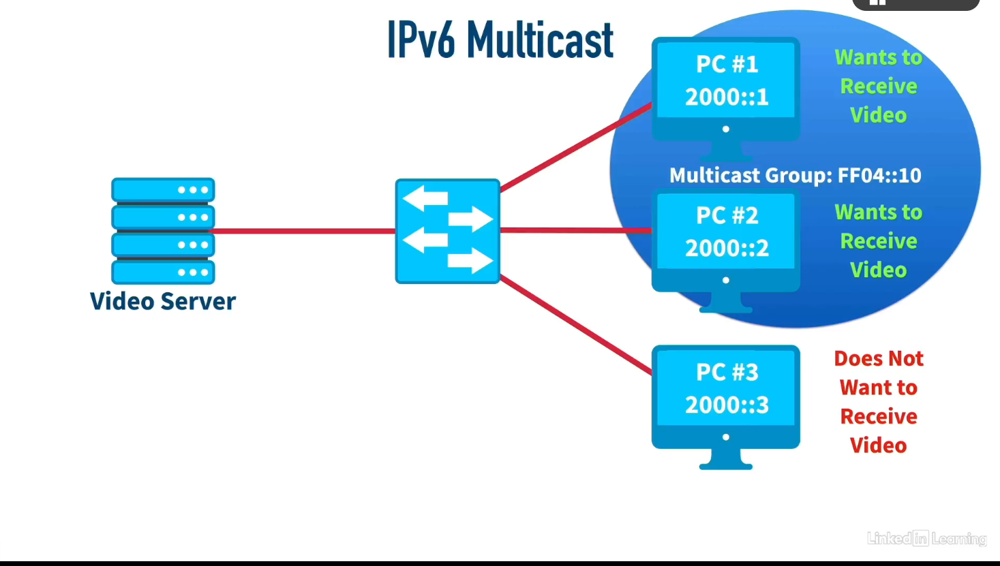
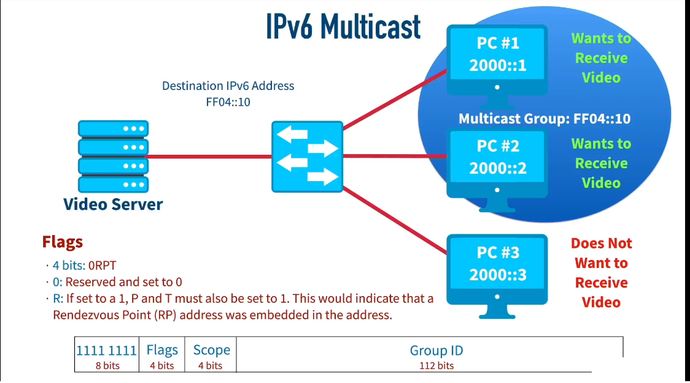
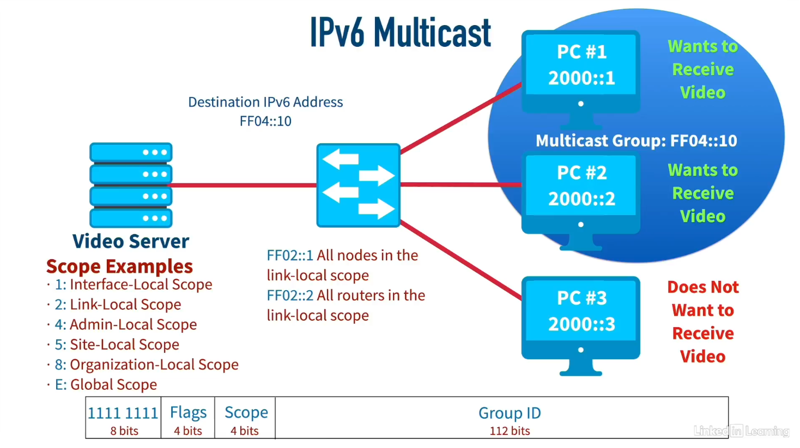
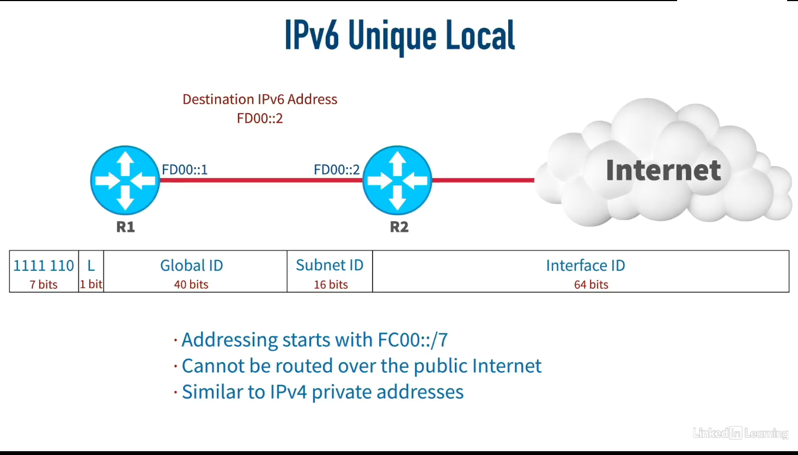
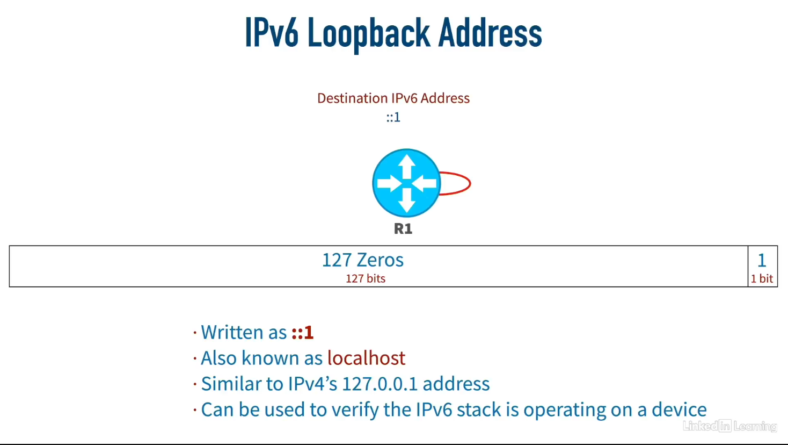
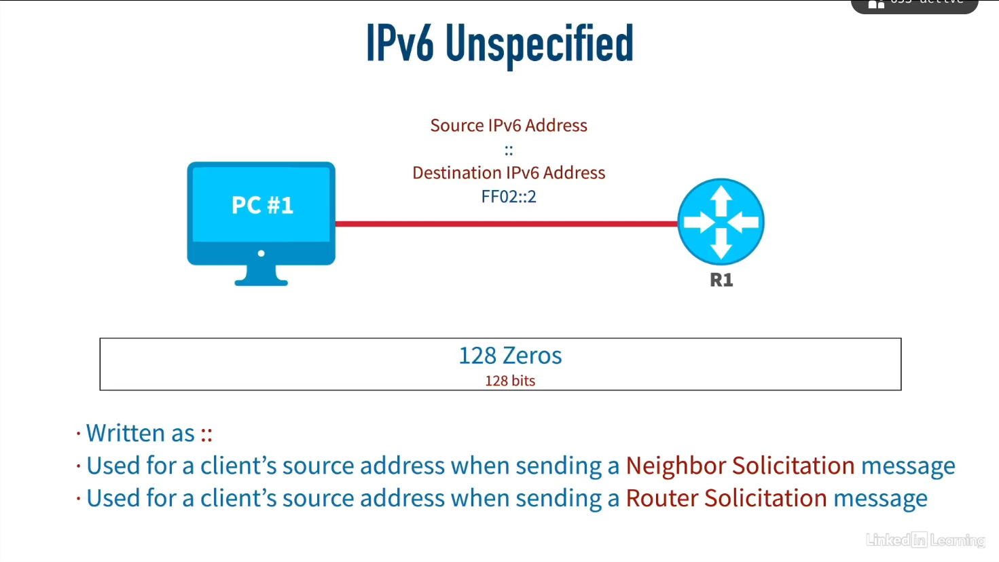
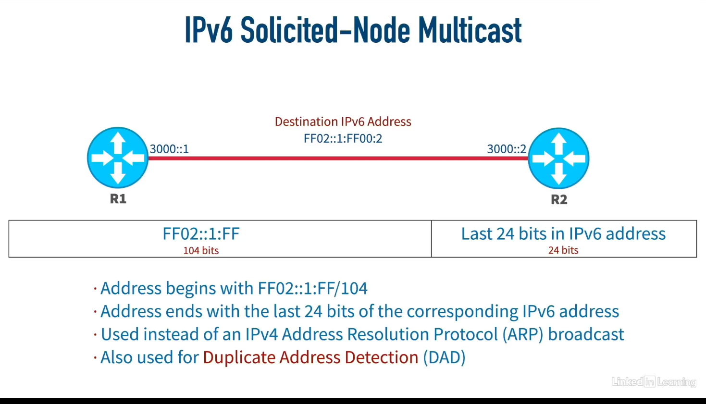
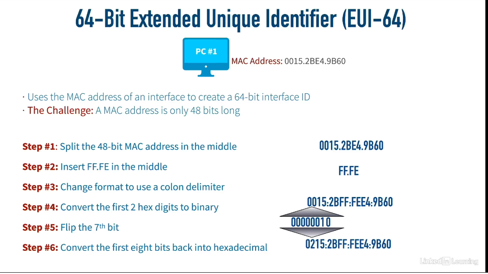

+++
title = "IPv6: The Next Generation Internet Protocol"
date = 2025-07-02
draft = false
tags = ["IPv6", "Networking", "Internet Protocol", "IP Addressing"]
categories = ["Networking", "Internet Protocols"]
description = "Explore the fundamentals of IPv6, its address types, configuration methods, and how it addresses the limitations of IPv4. Learn about Global Unicast, Multicast, Link-Local, Unique Local Addresses, and more."
summary = "A comprehensive guide to understanding IPv6, its features, and its advantages over IPv4."
+++
## Introduction

As the internet continues its exponential growth, the limitations of IPv4 have become increasingly apparent. Enter IPv6 (Internet Protocol version 6), the next-generation internet protocol designed to replace IPv4 and address its shortcomings. With its vastly expanded address space and improved features, IPv6 is not just an upgrade—it's a fundamental reimagining of how devices communicate on the internet.

## IPv6 Fundamentals

IPv6 addresses are 128 bits long, providing an astronomical number of unique addresses—approximately 340 undecillion (3.4 × 10^38). This massive address space ensures that we won't run out of IP addresses for the foreseeable future.

### Address Structure

- **128-bit addresses** represented as 32 hexadecimal numbers
- Organized into **8 quartets** of 4 hexadecimal digits each
- Separated by colons (e.g., 2001:0db8:85a3:0000:0000:8a2e:0370:7334)


## IPv6 Address Types

### 1. Global Unicast Addresses

Global Unicast Addresses are the IPv6 equivalent of public IPv4 addresses—they're publicly routable across the internet and uniquely identify devices worldwide.

**Key Characteristics:**

- Start with 2000::/3 (first three bits are 001)
- Can begin with hexadecimal 2 or 3
- Structured into three parts:
    - Global Routing Prefix (assigned by IANA)
    - Subnet ID
    - Host/Interface Identifier

The first three bits (001) are crucial for identification. In binary, this translates to:

- 0010 (binary) = 2 (hexadecimal)
- 0011 (binary) = 3 (hexadecimal)

This is why Global Unicast addresses typically start with 2 or 3, commonly represented as 2000::/3.

### 2. Multicast Addresses

IPv6 multicast enables efficient one-to-many communication, allowing a single packet to reach multiple destinations simultaneously.

**Address Format:**

```
| 11111111 | Flags | Scope | Group ID |
| 8 bits   | 4 bits| 4 bits| 112 bits |
```

- Always start with **FF** (first 8 bits are all ones)
- **Flags**: Define address properties
- **Scope**: Determines the reach of multicast traffic
- **Group ID**: Identifies the specific multicast group

**Common Scope Values:**

- Link-local scope (FF02::)
    - FF02::1 - All nodes on the local network segment
    - FF02::2 - All routers on the local network segment

Multicast groups allow devices to selectively receive traffic. For example, a video streaming server can send data to a multicast group, and only devices that have joined that group will receive the stream.






### 3. Link-Local Addresses

Link-local addresses provide automatic addressing for communication within a single network segment.


**Characteristics:**

- Format: **FE80::/10**
- First 10 bits: 1111 1110 10
- Followed by 54 zeros
- Last 64 bits: Interface ID
- Not routable beyond the local network segment
- Similar to IPv4 APIPA addresses (169.254.0.0/16)

Link-local addresses are particularly useful for:

- Automatic configuration without DHCP
- Router-to-router communication on the same segment
- Neighbor discovery protocol operations

### 4. Unique Local Addresses

Unique Local Addresses (ULA) are IPv6's answer to private addressing, similar to RFC 1918 addresses in IPv4.

**Format:**

- **FC00::/7** or **FD00::/7**
- The 8th bit (L bit) indicates local assignment
- Commonly begins with FD for locally assigned addresses

These addresses are:

- Routable within an organization
- Not routable on the public internet
- Comparable to IPv4 private ranges (10.0.0.0/8, 172.16.0.0/12, 192.168.0.0/16)

### 5. Special Purpose Addresses

#### Loopback Address

- **::1** (all zeros except the last bit)
- Used for testing local IPv6 stack
- Equivalent to 127.0.0.1 in IPv4

#### Unspecified Address

- **::** (all 128 bits are zero)
- Used when a device doesn't have an assigned IPv6 address
- Common in:
    - Neighbor solicitation messages
    - Duplicate Address Detection (DAD)
    - Initial DHCP requests


### 6. Solicited-Node Multicast Addresses

These special-purpose multicast addresses enable efficient address resolution in IPv6 networks, replacing the broadcast-based ARP used in IPv4.



**Example:**

- Unicast address: 2001:DB8::1234:5678
- Last 24 bits: 34:5678
- Solicited-node multicast: FF02::1:FF34:5678

**Benefits:**

- Reduces network traffic compared to broadcast ARP
- Only nodes with matching address suffixes process requests
- Essential for Neighbor Discovery Protocol
- Enables efficient Duplicate Address Detection

## Address Configuration Methods

### EUI-64 Process

EUI-64 is a method to automatically generate the 64-bit interface identifier from a device's 48-bit MAC address.

**Process:**


This creates a globally unique interface ID based on the hardware address, with the flipped 7th bit indicating whether the address is locally administered.

### Dynamic IPv6 Assignment

IPv6 supports multiple methods for dynamic address configuration:

1. **Stateless Address Autoconfiguration (SLAAC)**

    - Devices generate their own addresses
    - Uses router advertisements for network prefix
    - Combines prefix with EUI-64 or random interface ID
    
1. **DHCPv6 (Stateful)**
    
    - Server assigns complete addresses
    - Provides additional configuration information
    - Similar to DHCP in IPv4

2. **Stateless DHCPv6**
    
    - Combination of SLAAC and DHCPv6
    - Address from SLAAC, other parameters from DHCPv6

## Conclusion

IPv6 represents a significant evolution in internet protocols, addressing the limitations of IPv4 while introducing new capabilities. Its vast address space, improved efficiency through multicast addressing, and simplified autoconfiguration make it essential for the future of networking.

As we continue to connect more devices to the internet—from smartphones to IoT sensors—IPv6's role becomes increasingly critical. Understanding its address types, configuration methods, and special features is essential for network professionals and anyone working with modern internet infrastructure.

The transition to IPv6 is not just about having more addresses; it's about building a more efficient, scalable, and feature-rich internet that can support the next generation of connected devices and services.