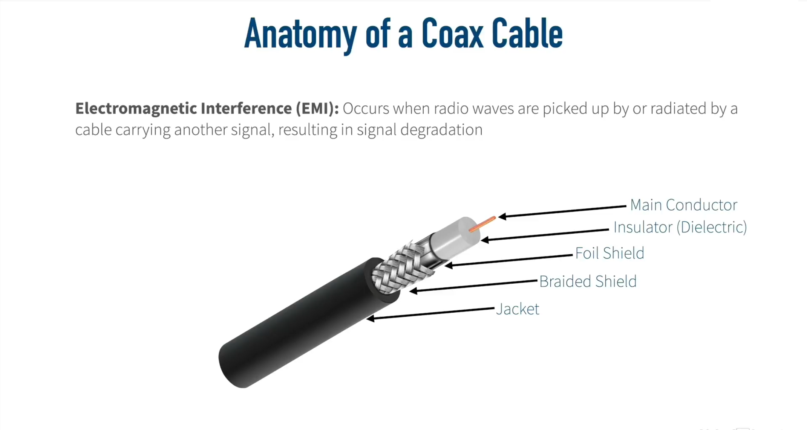
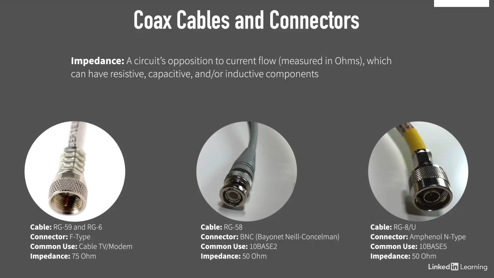
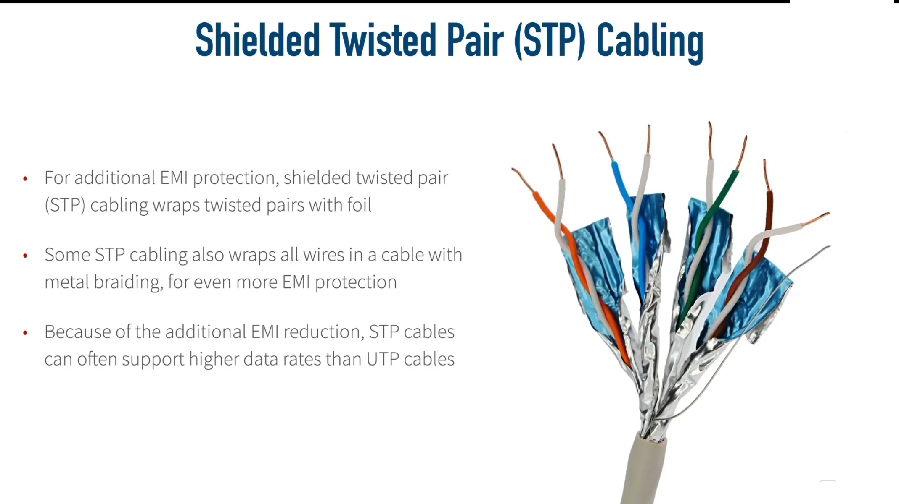
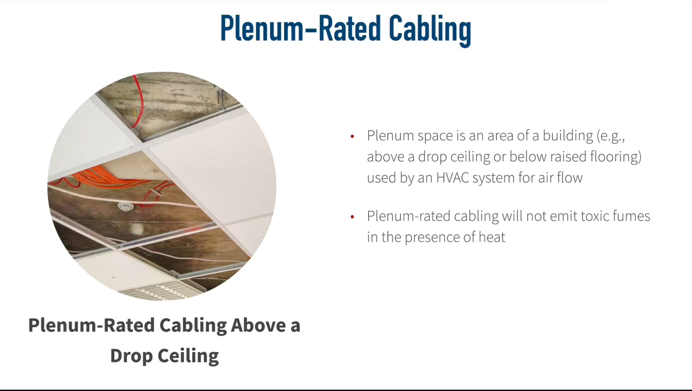
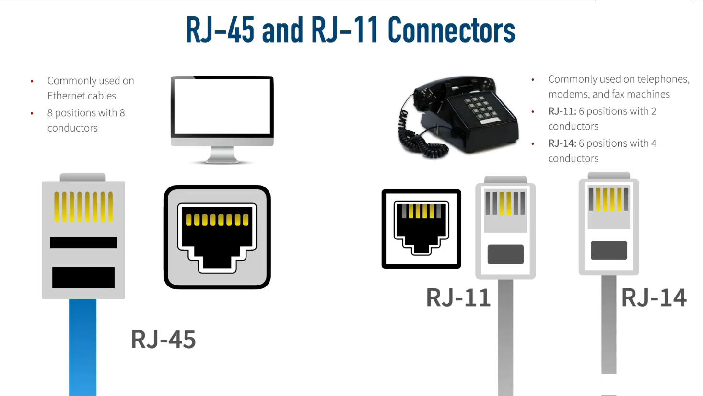
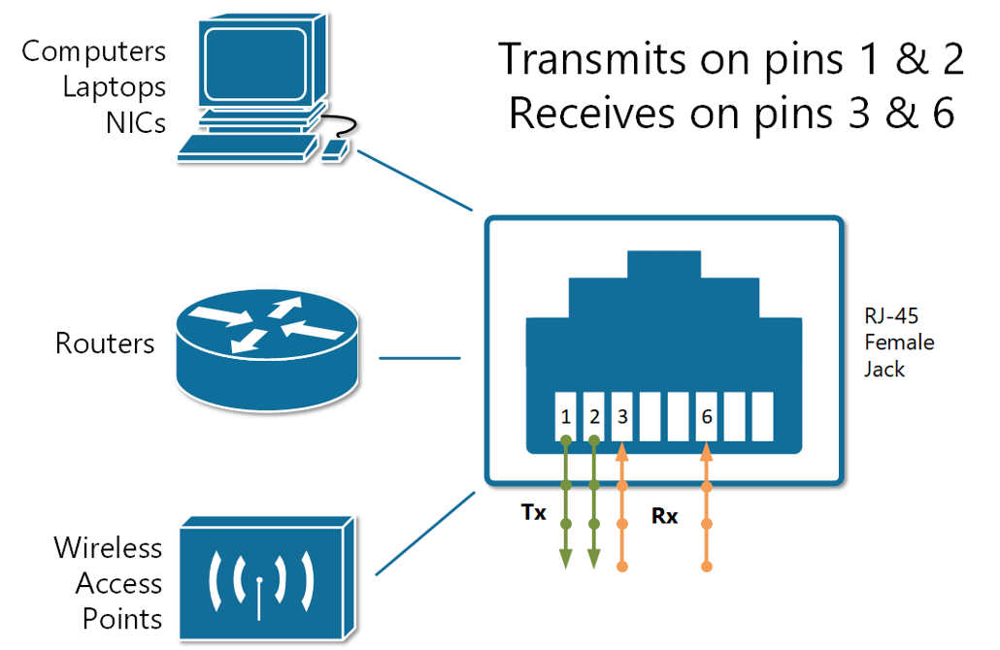
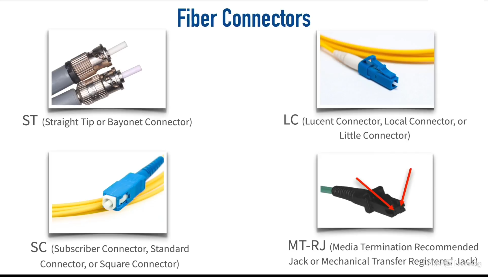

+++
title = "Network Cabling"
date = "2025-06-14"
draft = false
tags = ["ethernet", "fiber optics", "CCNA"]
categories = ["Networking", "Cabling"]
description = "Understanding Network Cabling: Coaxial, Twisted Pair, and Fiber Optics Cables for CCNA Certification"
summary = "An overview of network cabling, including coaxial cables, twisted pair cabling (UTP and STP), and fiber optics. Learn about their designs, types, and how they impact network performance. This guide is essential for CCNA certification preparation."
+++

Cabling makes up the physical lifeline that carries data across the network, and it really cannot be overstated how important cabling is, because it directly impacts the network's performance, scalability and reliability.

# Coaxial Cables 

In the early days, they were the backbone of many networks, and they are still in use today for some specific applications. When we talk about a wired network, that wire's often made of copper. After all, copper is a great conductor of electricity, and it has a high tensile strength, meaning that it doesn't stretch very easily. The two main types of copper cables we're likely to see in the networking world are coaxial cables, sometimes called coax for short, and twisted pair cabling.

The coaxial cable design is built for a main reason: we are trying to protect from electromagnetic interference (EMI). We don't want electromagnetic waves in the environment, like radio waves, to be intercepted by the network cable and corrupt our data. At the same time, we don't want our network cable to become an antenna and start radiating EMI and interfering with other nearby devices.

So the way a coax cable helps protect itself from EMI is by having the signal be sent down a center conductor. This main conductor is typically going to be made of copper, and it is surrounded by an insulator. Oftentimes, the dielectric is wrapped in a foil. That's going to provide some EMI protection. After all, an electromagnetic wave cannot go through a perfect conductor. Well, a foil shield is not a perfect conductor, but it's pretty good. But to give even further protection, that's going to be wrapped in a braided metal shield. And then all that's going to be wrapped up inside of, typically, a plastic jacket.

## Coaxial Cable Types
Common types of coaxial cables include RG-59 and RG-6 (used in home environments), RG-58 (used in older 10BASE2 networks), and RG-8/U (used in older 10BASE5 networks).

# Twisted Pair Cabling

A very popular type of copper cabling used in networking today is twisted pair cabling.

## Unshielded Twisted Pair (UTP)
The reason these pairs of wires are twisted around one another is to help combat electromagnetic interference (EMI). Since a radio wave cannot go through a perfect conductor, we take these two wires, which are really good conductors, and we wrap them around one another into a pair. That way one wire is protecting the other wire from interference and vice versa. And when we say unshielded twisted pair, we mean that there is no additional shielding. There's no foil wrapped around these wires; it's just the twisting alone that is providing the EMI protection.

## Shielded Twisted Pair (STP)

In some cases the unshielded twisted pair (UTP) cable is not enough. For example, if we are in an environment that has a lot of electromagnetic interference, the unshielded twisted pair might not be sufficient. In this case we can use the shielded twisted pair (STP) cable. This is where we're still twisting those pairs of wires, but to further protect from EMI, each pair is individually wrapped in foil. And in some shielded twisted pair cables, there's even a metal braiding that goes around all eight wires to add another level of protection.

The shielded twisted pair cables are more expensive, because there's more material—this extra shielding that goes into the cable—so unshielded twisted pair is usually more economical and widely used for most use cases. But another benefit of shielded twisted pair is that because it does have so much EMI protection, it oftentimes supports higher data rates than unshielded twisted pair cabling.

## Plenum Rated Cabling

Another variant of twisted pair cabling is plenum-rated cabling. A plenum area is an area that you might find above a drop ceiling in an office or maybe in a data center you have a raised floor. And if those areas below the raised floor or above the drop ceiling, if those areas are being used by the HVAC system (Heating, Ventilation, and Air Conditioning) for air return, then those areas are plenum areas.

There is a serious danger of using regular network cabling in these plenum areas because if there were a fire in the building and those cables were exposed to a lot of heat, some of those cables that are not plenum rated can start to emit toxic fumes.

## Connectors

The RJ-45 connector is the most common for Ethernet networks, while RJ-11 and RJ-14 connectors are used for telephone connections.

## The Wiring Standard 

There are different standards that say which color wire goes into which pin. The two most common standards out there are the T568A and T568B standards. And one is not better than the other; you just want to make sure that you're using the same standard at each end of the cable and that the jack you're plugging into is using that same standard. But in networks today, the T568B standard is most commonly used.

# Ethernet Standards for Twisted Pair Cables

Twisted pair cabling falls under different categories. We want to identify the Category or categories used by specific Ethernet standards along with the throughput and distance limitations of those standards.

# Ethernet Cable Types

A typical Ethernet cable has RJ-45 connectors on both ends. Each RJ-45 connector has eight _pins_ into which the eight wires can be inserted. Ethernet cables are **straight-through** cables or **crossover** cables.

In order to understand the difference between the two main types of Ethernet cables: straight-through cable and crossover cable, we must first understand how the different types of devices transmit electrical signals on their RJ45 connectors.

**Computers, Routers, and Wireless Access Points** also called **MDI** (Media Dependent Interface). These devices use pins **1** and **2** to transmit data in the form of electrical signals and the pair of pins at positions **3** and **6** to receive data.

The other group of devices such as Ethernet **Hubs, Bridges and Switches** also called **MDI-X** (Media Dependent Interface Crossover) use pins **3** and **6** to transmit data in the form of electrical signals and the pair of pins at positions **1** and **2** to receive data. This is exactly the opposite of the example above.

## Straight-Through Cable

A straight-through cable connects the wire at pin **1** on one end of the cable straight to pin **1** at the other end of the cable, and so on for other pins as shown in the image below.

When we connect a device that transmits on pins **1&2** with a device that receives on pins **1&2**. For example, a PC connected to a LAN switch using a straight-through cable. As shown in the figure below, everything works correctly because the devices on the right use the opposite pins to transmit and receive electrical signals.

But, if we connect two like devices with a straight cable. For example, a router connected to a router or a computer's NIC card connected directly to a router. The figure below shows what happens on a link between the devices. The two routers both transmit on the pair at pins **1** and **2**, and they both receive on the pair at pins **3** and **6**. So the signal being transmitted on both sides can't get to the respective receiving end and communication is not possible.

## Crossover Cable

The solution to this problem is to cross-connect the cable wires in such a way, so the transmitting pins on one side connect to the receiving pins on the other side and vice versa. If some of the wires are crossed, the cable is not "straight" anymore; that's why it is called a crossover cable.

## Modern Networks

In modern networks today, a lot of switches and other network equipment have a feature called **auto MDI-X** that will allow the two switches to determine which side is going to be using pins **1** and **2** for transmit, and which side is going to be using pins **1** and **2** for receiving. They'll negotiate that between themselves with auto **MDI-X**.

In the newer standards that support higher data speeds, all 8 pins are used for both transmitting and receiving.

### 10BASE-T and 100BASE-TX (Older Standards)
- **Speed**: 10 Mbps and 100 Mbps
- **Pins used**: Only 4 wires (pins 1, 2, 3, 6)
- **Pins 4, 5, 7, 8**: Not used

### 1000BASE-T (Gigabit Ethernet)
- **Speed**: 1 Gbps
- **Pins used**: All 8 wires (all pins 1-8)
- **Major change**: Requires all pairs

# Fiber Optic Cables

Fiber optic cables offer a significant advantage over traditional copper cabling: **immunity to Electromagnetic Interference (EMI)**. Unlike copper cables that use electromagnetic waves to transmit data, fiber optic cables use light as the transmission medium, making them completely immune to EMI disruption.

## The Physics Behind Fiber Optics

### Index of Refraction
The fundamental principle behind fiber optics is based on the concept of **index of refraction**. In the figure below, when the light hits the glass material, we see it bend because light travels at different speeds through different materials. Glass has a different index of refraction than air, causing light to bend when transitioning between these mediums.

### Fiber Optic Cable Structure
A fiber optic cable consists of two types of glass with different indices of refraction:

- **Core**: The inner glass where light travels
- **Cladding**: The outer glass layer surrounding the core

During manufacturing, different dopants are added to the core and cladding, creating distinct indices of refraction. This difference is so significant that light can actually bend back on itself, keeping it contained within the core and preventing it from escaping into the cladding.

## Types of Fiber Optic Cables

### Multimode Fiber (MMF)
- **Core diameter**: Larger than single-mode fiber
- **Light paths**: Multiple modes (paths) of light can travel through the cable
- **Distance limitation**: Approximately 2 kilometers

### Single-Mode Fiber (SMF)  
- **Core diameter**: Much smaller than multimode fiber
- **Light paths**: Only one mode (path) of light can travel through the cable
- **Distance capability**: Much greater than multimode fiber

## Understanding "Mode"
A **mode** refers to a specific path that light takes through the fiber optic cable. The number of possible modes depends on the core diameter:
- Larger core = multiple possible light paths
- Smaller core = single possible light path

## The Problem with Multimode Fiber: Multimode Delay Distortion

### How It Occurs
In multimode fiber, different light beams can take various paths:
- **Direct path**: Light travels straight through with minimal bouncing
- **Angled path**: Light enters at steep angles, bouncing repeatedly off the cladding

### The Data Corruption Issue
Consider this scenario:
1. A binary "1" enters the cable using a path that bounces frequently (red path)
2. A binary "0" follows, using a more direct path (green path)
3. Over long distances, the "0" can overtake the "1" because the bouncing path takes longer
4. **Result**: Data that should output as "1-0" instead outputs as "0-1"

This phenomenon is called **multimode delay distortion** and limits multimode fiber to shorter distances.

## Why Single-Mode Fiber Solves This Problem

Single-mode fiber eliminates multimode delay distortion because:
- The core diameter is so small that only **one path of light** is permitted
- All data bits travel the same route through the cable
- No bit can "pass up" another bit since there's only one allowable path
- This enables much greater transmission distances without data corruption

# Ethernet Standards for Fiber Optic Cabling

Fiber optic cables are categorized by their transmission speeds and distances, similar to twisted pair cabling.

# Fiber Optic Cable Connectors

Fiber optic cables use specialized connectors to ensure proper alignment and signal transmission. The most common types of fiber optic connectors as shown in the image below are SC, LC, ST, and MT-RJ connectors. Each type has its own design and application, but they all serve the same purpose: to connect fiber optic cables securely and efficiently.

# References

1. https://www.phoenixcontact.com/en-pc/technologies/copper-based-data-cabling

2. https://tripplite.eaton.com/products/ethernet-cable-types

3. https://en.wikipedia.org/wiki/Medium-dependent_interface

4. https://en.wikipedia.org/wiki/Refractive_index

5. https://rfindustries.com/fiber-optic-cable-types-multimode-and-single-mode/
