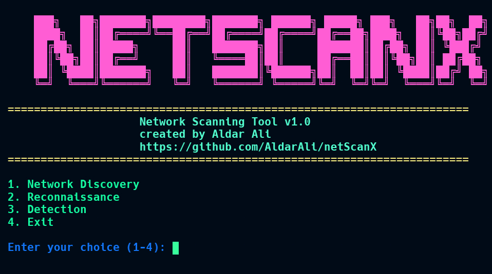

I always make an effort to set aside time for both work and self-improvement. Although many of these passion projects never fully materialize, they offer invaluable opportunities to experiment in real-world scenarios and learn practical skills.

<table>
    <thead>
        <tr>
            <th>Logo</th>
            <th>Title</th>
            <th>Description</th>
            <th>References</th>
        </tr>
    </thead>
    <tbody>
         <tr>
            <td></td>
            <td>
              netscanX
              
                Completed
              
            </td>
            <td>A network scanning and security analysis tool for Linux environments.</td>
            <td> <a target="_blank" href="https://github.com/AldarAli/netScanX">github</a></td>
        </tr>
         <tr>
            <td></td>
            <td>
              Chatbot
              
              Completed
              
            </td>
            <td>AI-powered chatbot trained on content from the ThinkMind library, with the goal of providing users with relevant articles and conferences in an efficient manner. The project was implemented in Python, using the Langchain framework to integrate LLM models and vector databases.</td>
            <td>
             
             <a target="_blank" href="https://github.com/AldarAli/Chatbot">github</a></td>
        </tr>
        <tr>
        </tr>
    </tbody>
</table>