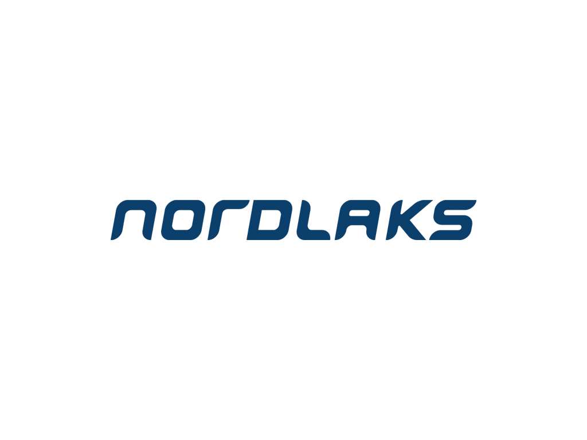
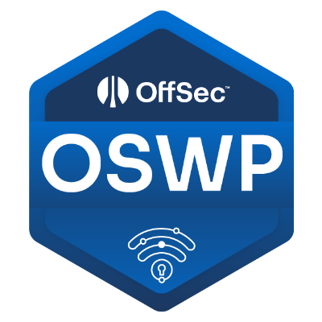
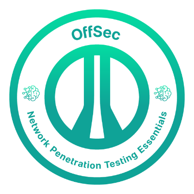

## Experience

<table>
    <thead>
        <tr>
            <th>Company</th>
            <th>Link</th>
            <th>Role</th>
            <th>Dates</th>
            <th>Location</th>
        </tr>
    </thead>
    <tbody>
        <tr>
            <td rowspan=3></td>
            <td rowspan=3><a href="https://www.kriminalomsorgen.no/" target="_blank">KDI</a></td>
        </tr>
        <tr>
            <td>IT Consultant</td>
            <td>2023 - Present</td>
            <td>Horten  Norway</td>
        </tr>
        <tr>
        </tr>
        <tr>
            <td></td>
            <td><a href="https://sikt.no/en/home" target="_blank">Sikt</a></td>
            <td>Internship System Developer</td>
            <td>2023 - 2023</td>
            <td>Oslo Norway</td>
        </tr>
        <tr>
            <td rowspan=3></td>
            <td rowspan=3><a href="https://www.nordlaks.no/" target="_blank">Nordlaks</a></td>
        </tr>
        <tr>
            <td>Process operator</td>
            <td>2018 - 2022</td>
            <td>Stokmarknes Norway </td>
        </tr>
        <tr>
        </tr>
    </tbody>
</table>

---

## Education

<table>
    <thead>
        <tr>
            <th>School</th>
            <th>Link</th>
            <th>Degree</th>
            <th>Date</th>
        </tr>
    </thead>
    <tbody>
        <tr>
            <td></td>
            <td><a href="https://www.credential.net/ab1a01f6-de14-46d9-bea9-3348d06150bc#acc.ZUCkABHb" target="_blank">Offensive Security</a></td>
            <td>Offensive Security Wireless Professional (OSWP)</td>
            <td>2025</td>
        </tr>
        <tr>
            <td></td>
            <td><a href="https://www.credential.net/6c6a403c-3dee-4042-b60f-3df12e7a4d85#acc.s5m4bJQp" target="_blank">Offensive Security</a></td>
            <td>Network Penetration Testing Essentials</td>
            <td>2025</td>
        </tr>
        <tr>
            <td></td>
            <td><a href="https://www.usn.no/english/" target="_blank">University of South-Eastern Norway</a></td>
            <td>Bachelor's degree in IT and information systems.</td>
            <td>2024</td>
        </tr>
    </tbody>
</table>